# RiskDesk — Portfolio Risk & Construction Workbench

**A complete user guide, written for someone who has never used a risk system.**

RiskDesk is a web application that tells a Chief Investment Officer (CIO) three things about a portfolio: *where the risk is*, *what would happen if I made this trade*, and *what the book should look like instead*. It runs on a laptop, needs no data vendor, and every number on screen is explained in this document.

This guide is long on purpose. It walks through every page in the left-hand menu, every card on every page, every column of every table, with the real screenshots and the real numbers, so you can answer any question about the platform by jumping to the right section. Terms are explained the first time they appear, and there is a glossary at the end.

> **How to use this guide during a demo.** Press Ctrl+F and type the name of the page or the metric the client asked about. Every page section has the same shape: *what it is for*, *the screenshot*, *reading the screen*, *how the number is calculated*, and *questions a client may ask*.

---

## Contents

**Part 1 — Getting started**
- [1.1 What RiskDesk is, in one page](#11-what-riskdesk-is-in-one-page)
- [1.2 Installing and running it](#12-installing-and-running-it)
- [1.3 The three demo portfolios](#13-the-three-demo-portfolios)

**Part 2 — How to read any screen**
- [2.1 Conventions every number follows](#21-conventions-every-number-follows)
- [2.2 The top bar](#22-the-top-bar)
- [2.3 The sidebar and the as-of date](#23-the-sidebar-and-the-as-of-date)
- [2.4 Card tools: maximise, sort, filter, download](#24-card-tools-maximise-sort-filter-download)
- [2.5 Warnings](#25-warnings)

**Part 3 — The pages, one by one (sidebar order)**
- [3.1 Home: the portfolio list](#31-home-the-portfolio-list)
- [3.2 Overview](#32-overview)
- [3.3 Positions](#33-positions)
- [3.4 Risk › Decomposition](#34-risk--decomposition)
- [3.5 Risk › Factor exposures](#35-risk--factor-exposures)
- [3.6 Risk › VaR & drawdowns](#36-risk--var--drawdowns)
- [3.7 Risk › Stress tests](#37-risk--stress-tests)
- [3.8 Risk › Correlation](#38-risk--correlation)
- [3.9 Risk › Liquidity & concentration](#39-risk--liquidity--concentration)
- [3.10 Risk › Risk history](#310-risk--risk-history)
- [3.11 Trades › Pre-trade what-if](#311-trades--pre-trade-what-if)
- [3.12 Trades › Trade proposals](#312-trades--trade-proposals)
- [3.13 Construction › Optimiser](#313-construction--optimiser)
- [3.14 Construction › Position sizing](#314-construction--position-sizing)
- [3.15 Construction › Backtest](#315-construction--backtest)
- [3.16 Governance › Risk limits](#316-governance--risk-limits)
- [3.17 Governance › Risk report and exports](#317-governance--risk-report-and-exports)
- [3.18 Governance › Analytics settings](#318-governance--analytics-settings)
- [3.19 Market data and the instrument page](#319-market-data-and-the-instrument-page)
- [3.20 The API](#320-the-api)
- [3.21 The admin site](#321-the-admin-site)

**Part 4 — The maths, in plain words**
- [4.1 Returns and the lookback window](#41-returns-and-the-lookback-window)
- [4.2 Volatility and the covariance matrix](#42-volatility-and-the-covariance-matrix)
- [4.3 Risk contributions (Euler decomposition)](#43-risk-contributions-euler-decomposition)
- [4.4 Value at Risk and Expected Shortfall](#44-value-at-risk-and-expected-shortfall)
- [4.5 The factor model](#45-the-factor-model)
- [4.6 Stress tests](#46-stress-tests)
- [4.7 Concentration and liquidity measures](#47-concentration-and-liquidity-measures)
- [4.8 The optimisers](#48-the-optimisers)
- [4.9 The backtest](#49-the-backtest)
- [4.10 The insight rules](#410-the-insight-rules)

**Part 5 — Questions a client may ask**  ·  **Part 6 — A ten-minute demo script**  ·  **Part 7 — Glossary**  ·  **Part 8 — For developers**

---

# Part 1 — Getting started

## 1.1 What RiskDesk is, in one page

A portfolio is a list of holdings. A risk system turns that list into answers. RiskDesk answers these questions, and this table tells you which page answers each one:

| The CIO asks | RiskDesk page | What you get |
|---|---|---|
| How big is the book and how is it positioned? | Overview, Positions | NAV, long/short/gross/net exposure, cash, sector and stock weights |
| Where is the risk actually coming from? | Decomposition | Each stock's and sector's share of total risk, which is often very different from its share of the money |
| What market forces am I exposed to? | Factor exposures | Sensitivity to the market, value vs growth, momentum, rates, credit, dollar, gold, oil |
| How much could I lose on a bad day? | VaR & drawdowns | Value at Risk and Expected Shortfall by four methods, worst days, worst drawdowns |
| What happens in a crisis? | Stress tests | The book replayed through COVID, the 2022 bear market, the 2025 tariff shock, plus hypothetical shocks you design |
| Are my positions really different bets? | Correlation | Correlation matrix, principal components, pairs that move as one |
| Can I get out quickly? | Liquidity & concentration | Days to liquidate each name, concentration measures |
| How has risk changed over time? | Risk history | Daily record of vol, VaR, beta, exposure |
| **If I put this trade on, what changes?** | **Pre-trade what-if** | Full before/after on every metric and every limit, with a green/amber/red verdict |
| What did we decide and why? | Trade proposals | Saved what-ifs with their risk snapshot, approval status, and one-click booking |
| What should the book look like? | Optimiser | Nine optimisation methods under real-world constraints, producing a share-level trade list |
| How big should each position be? | Position sizing | Vol targeting, equal risk contribution, sizing a new idea to a risk budget |
| Would a rule have done better? | Backtest | Walk-forward comparison of allocation rules with costs |
| Are we inside the mandate? | Risk limits | Rules with breach status, checked on every page and every what-if |
| Send me the numbers | Risk report, Excel, CSV, API | Printable daily pack, spreadsheet, machine-readable data |

Everything is computed from daily prices. The bundled data set has 69 instruments (40 US stocks and 29 ETFs) from December 2019 to September 2026, so the stress tests cover the COVID crash, the 2022 bear market and the 2025 tariff shock.

## 1.2 Installing and running it

Requirements: Python 3.11 or newer. Everything else installs with one command.

```bash
cd riskdesk
pip install -r requirements.txt
python manage.py migrate               # creates the local database file
python manage.py load_sample_data      # loads prices, instruments, three demo portfolios and the demo user
python manage.py runserver             # starts the web server
```

On Windows you can instead double-click `run.bat`, which does all of the above the first time.

Open **http://127.0.0.1:8000** in a browser and sign in.

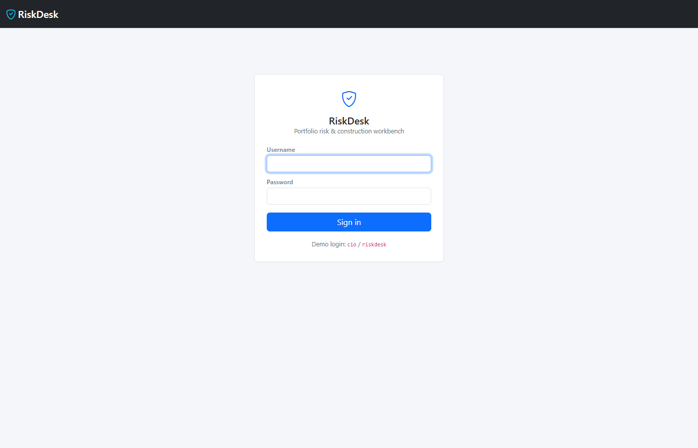

| Username | Password |
|---|---|
| `cio` | `riskdesk` |

To confirm everything works, run the automated tests. They take about half a minute:

```bash
python manage.py test
```

You should see `Ran 32 tests ... OK`.

## 1.3 The three demo portfolios

The sample data includes three books, each chosen to show a different side of the platform. Most screenshots in this guide use the first one.

| Portfolio | Size | What it is | Why it is in the demo |
|---|---|---|---|
| **Flagship Long/Short Equity** | $50m | 22 long US stocks, 7 short stocks, a short SPY index hedge, plus small long positions in TLT (long-dated US Treasuries) and GLD (gold) | Shows shorts, hedges, negative risk contributions and a beta target. It deliberately breaks two limits so the monitoring has something to say |
| **Multi-Asset Balanced** | $120m | Eleven long-only ETFs across US and global equities, Treasuries, credit, gold and real estate | Best for the optimiser, risk parity and backtests |
| **Concentrated Growth** | $25m | Ten high-conviction growth stocks | Shows what concentration looks like: four limit breaches and eleven insights |

You may also see a **Mock portfolio** on the home page. That is a small book created by hand through the interface, kept to show that portfolios can be created from scratch.

---

# Part 2 — How to read any screen

## 2.1 Conventions every number follows

These rules hold on every page, so learn them once.

- **Percentages are shares of NAV** unless labelled otherwise. NAV (net asset value) is the total worth of the portfolio, positions plus cash. "NVDA 7.0%" means NVDA's market value is 7% of NAV.
- **Volatility, returns and Sharpe are annualised.** A daily number is scaled to a yearly one so different books can be compared. To get a feel for a daily move, divide annual volatility by 16 (the square root of 252 trading days). 8.4% a year is roughly 0.5% a day.
- **Losses are shown as positive numbers in VaR and ES.** "VaR 1.17%" means a loss of 1.17%.
- **A negative sign on a weight means a short position**, a bet that the price falls. A negative risk share means the position *reduces* total risk, which is what a hedge should do.
- **Pro forma** means "as if you had held today's exact positions the whole time". The performance numbers are not the fund's real history. They describe how the current book behaves. See the [glossary](#part-7--glossary) for why risk people prefer this.
- **Lookback window** is how much history the risk model studies. The default is 504 trading days, about two years. It is shown in the page header and can be changed in Analytics settings.
- Every number is recomputed live from prices when a page loads. There is no overnight batch to wait for.

## 2.2 The top bar

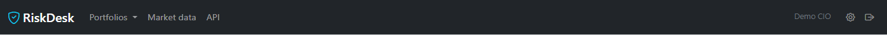

From left to right: the **RiskDesk** logo returns to the home page. The **portfolio switcher** drops down to any portfolio or to *New portfolio*. **Market data** opens the instrument universe. **API** opens the developer documentation. On the right: the signed-in user, a cog for the admin site, and sign out.

## 2.3 The sidebar and the as-of date

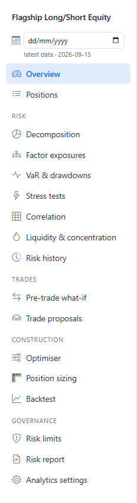

The sidebar appears whenever you are inside a portfolio. It is grouped the way an investment team thinks:

- **Overview** and **Positions**: what we hold.
- **Risk**: seven views of the same book, each answering a different question.
- **Trades**: testing and recording changes.
- **Construction**: what the book should look like.
- **Governance**: the mandate, the daily report, and the model settings.

**The as-of date.** The calendar box under the portfolio name re-runs *every page* as of a past date. Pick 8 April 2025, for example, and the whole app shows today's holdings priced and measured on that day, with the two-year lookback ending there. A yellow banner reminds you that you are in the past, and the ⓧ returns to the latest data.

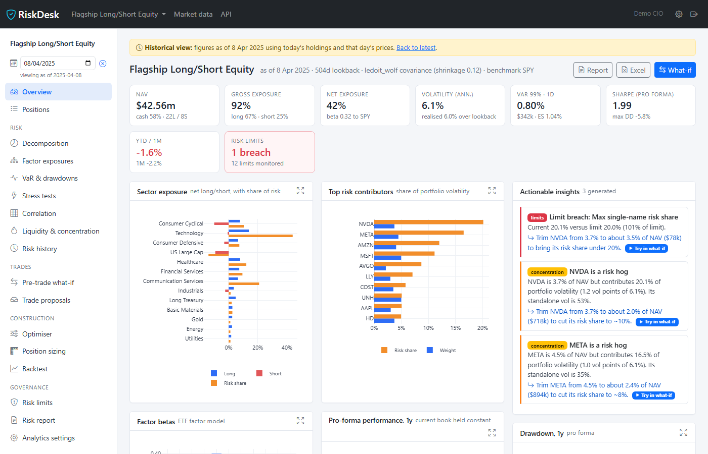

Use this to answer "what would our current book have looked like going into the tariff shock?" without touching the live positions. Note that it holds today's *share counts* constant, so NAV changes with that day's prices. That is the standard pro-forma convention and the banner says so.

## 2.4 Card tools: maximise, sort, filter, download

Every chart and every table sits inside a card. The top-right corner of each card has small tools:

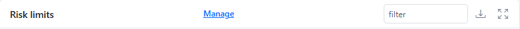

- **filter box** (tables with more than ten rows): type to keep only matching rows.
- **⬇ download**: saves the table as a CSV file that opens in Excel.
- **⤢ maximise**: the card fills the screen and charts redraw at full size. Press Esc or click outside to close.

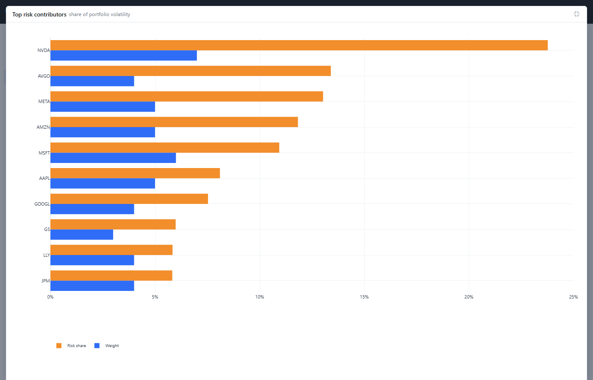

**Click any column header to sort** a table. Click again to reverse. The sort understands percentages, dollar amounts with k/m/bn suffixes, and durations, so "$1.50m" sorts above "$585k".

## 2.5 Warnings

If a holding has no price history, or has too little history for the lookback window, a yellow banner says so on every page of that portfolio, and tells you what was excluded and how to fix it. Nothing is ever dropped silently.

---

# Part 3 — The pages, one by one

## 3.1 Home: the portfolio list

**What it is for.** One card per portfolio with the headline numbers, so the CIO sees the state of every book in one glance.

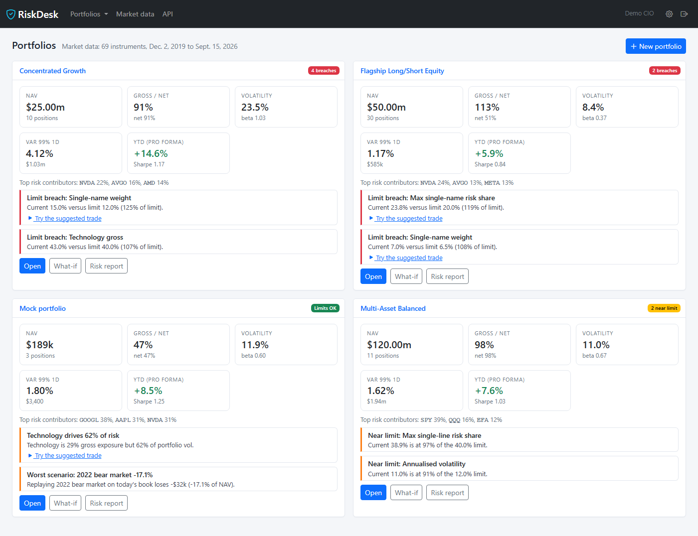

**Reading a card.** Take the Flagship card:

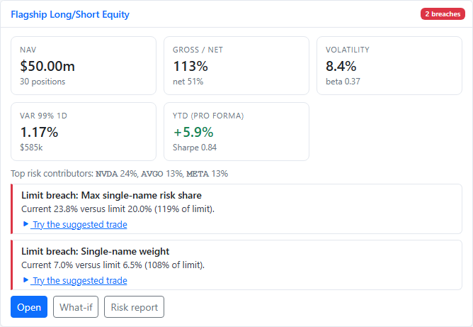

| Item | Meaning | Value shown |
|---|---|---|
| Badge top right | Limit status. Red = at least one limit broken, amber = at least one within 10% of its threshold, green = all clear | 2 breaches |
| NAV | Net asset value, positions plus cash | $50.00m, 30 positions |
| Gross / net | Gross = longs plus shorts, as % of NAV. Net = longs minus shorts | 113% gross, 51% net |
| Volatility | Expected yearly swing of the book | 8.4%, beta 0.37 |
| VaR 99% 1d | The one-day loss that should only be exceeded 1 day in 100 | 1.17% = $585k |
| YTD (pro forma) | Return since 1 January if today's book had been held | +5.9%, Sharpe 0.84 |
| Top risk contributors | The three names carrying the most risk | NVDA 24%, AVGO 13%, META 13% |
| Insight strip | The two most important insights, with a link to test the suggested trade | Two limit breaches |

The buttons open the Overview, the What-if page, or the printable Risk report.

The header line ("Market data: 69 instruments, Dec. 2, 2019 to Sept. 15, 2026") tells you how much price history is loaded and how fresh it is.

## 3.2 Overview

**What it is for.** The daily one-screen briefing: size, exposure, risk, performance, limit status, the biggest risks, and what to do about them. If a client only ever looks at one page, this is it.

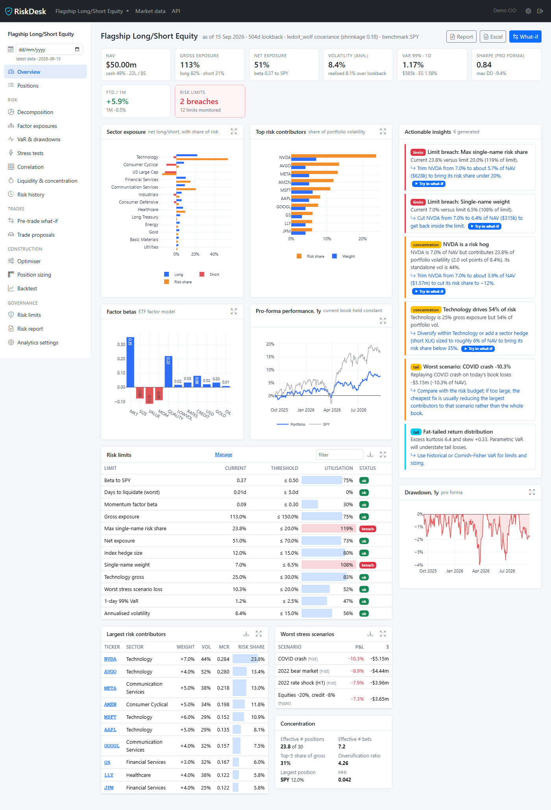

### The header line

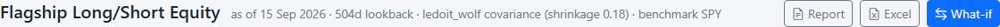

"as of 15 Sep 2026 · 504d lookback · ledoit_wolf covariance (shrinkage 0.18) · benchmark SPY". This is the recipe behind every number: the price date, the two-year window, the method used to estimate how stocks move together (explained in [4.2](#42-volatility-and-the-covariance-matrix)), and the index the book is compared with. The three buttons open the printable report, download the Excel risk pack, or jump to the what-if page.

### The eight number cards

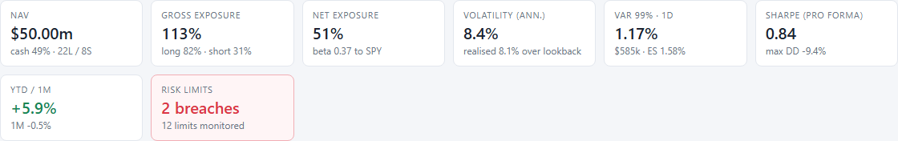

| Card | What it means | How it is calculated | Flagship value |
|---|---|---|---|
| **NAV** | Total worth of the portfolio | Sum of every position's market value, plus cash | $50.00m. Cash is 49% of NAV because short sales bring in cash. 22 longs, 8 shorts |
| **Gross exposure** | How much money is at work, counting shorts as positive | (long value + \|short value\|) ÷ NAV | 113%: 82% long plus 31% short |
| **Net exposure** | The book's directional bet on the market | (long value − \|short value\|) ÷ NAV | 51%. "Beta 0.37 to SPY" means a 10% fall in SPY would be expected to cost the book about 3.7% |
| **Volatility (ann.)** | The typical size of a year's swing, from the risk model | Square root of (weights × covariance × weights), annualised | 8.4%. "Realised 8.1%" is what actually happened over the window. When the two agree, the model is well calibrated |
| **VaR 99% · 1d** | The loss that should only be exceeded one day in a hundred | 1st percentile of the last 504 daily pro-forma returns | 1.17% = $585k. ES 1.58% is the average loss on the days beyond that line |
| **Sharpe (pro forma)** | Return earned above cash, per unit of volatility. Above 1 is good | (annual return − risk-free rate) ÷ annual volatility | 0.84. Max drawdown −9.4% is the worst peak-to-trough fall in the window |
| **YTD / 1M** | Return since 1 January and over the last 21 trading days | Compounded daily pro-forma returns | +5.9% and −0.5% |
| **Risk limits** | How many mandate rules are broken | See [3.16](#316-governance--risk-limits) | 2 breaches of 12 monitored. The card turns red |

### Sector exposure

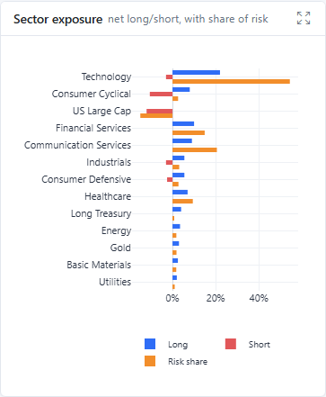

Three bars per sector. **Blue** is the long weight, **red** the short weight, **orange** the sector's share of total risk. The point of the chart is the gap between money and risk: Technology is 25% of gross money but 54% of the risk. "US Large Cap" is the SPY index hedge, which shows as a red short bar and an orange bar pointing left, meaning it *subtracts* risk.

### Top risk contributors

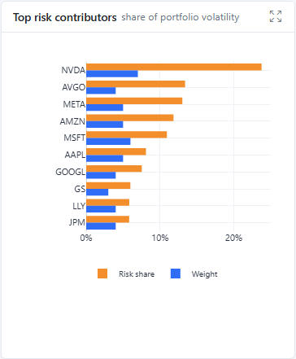

For the ten largest risk contributors, **blue** is the weight and **orange** is the share of portfolio volatility. NVDA is 7% of the money but 24% of the risk. The orange bars of all thirty positions add up to exactly 100%. How this is computed is the single most important idea in the platform and is explained in [4.3](#43-risk-contributions-euler-decomposition).

### Factor betas

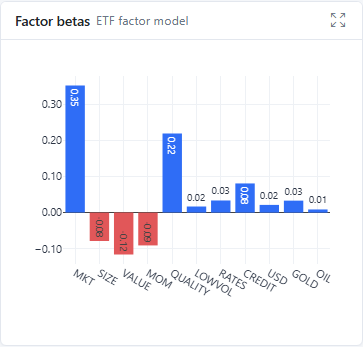

How sensitive the book is to eleven broad market forces. A beta of 0.35 to MKT means the book moves 0.35% for every 1% the US equity market moves. Bars are blue when positive, red when negative. Details in [3.5](#35-risk--factor-exposures).

### Pro-forma performance, 1y

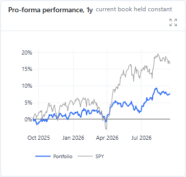

What today's exact holdings would have returned over the past year (blue) against the benchmark (grey). For a hedged long/short book, tracking well below the index in a rising market is expected: the SPY short and the low net exposure are doing their job.

### Risk limits

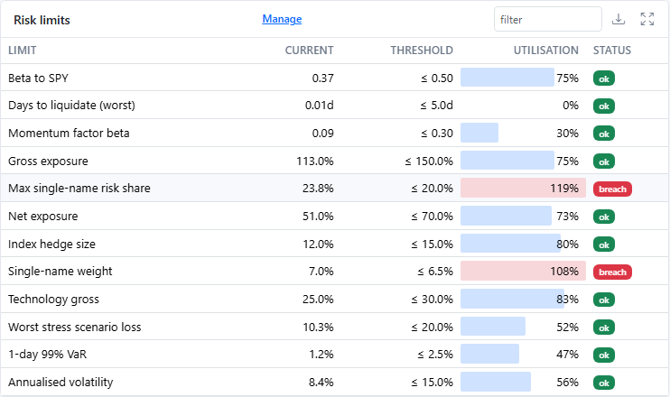

Every mandate rule with its current value, threshold, and a utilisation bar. Utilisation is current ÷ threshold: 75% means three-quarters of the way to the limit. Bars turn red at 100%. Here two rules are red: *Max single-name risk share* (23.8% against a 20% cap) and *Single-name weight* (7.0% against 6.5%). Both are NVDA.

### Largest risk contributors (table)

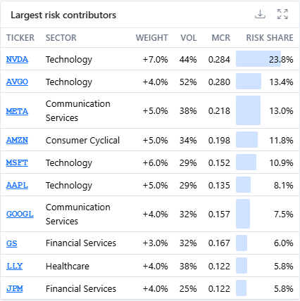

The same information as the chart, with more columns:

| Column | Meaning |
|---|---|
| Weight | Market value ÷ NAV. Negative = short |
| Vol | The stock's own annual volatility, on its own, ignoring the rest of the book. NVDA 44%, AVGO 52% |
| MCR | Marginal contribution to risk: how much portfolio volatility rises if you add one more unit of weight. NVDA 0.284 means adding 1% of NAV in NVDA raises book volatility by about 0.28 percentage points |
| Risk share | The stock's share of total portfolio volatility |

### Worst stress scenarios and Concentration

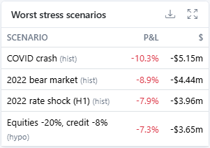 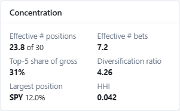

The four scenarios that hurt most (full list on the Stress page) and six concentration statistics (explained on the Liquidity page, [3.9](#39-risk--liquidity--concentration)). Replaying the COVID crash on today's book loses 10.3%, $5.15m.

### Actionable insights

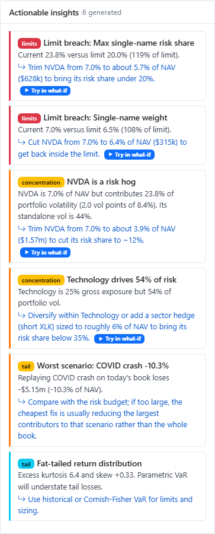

Plain-language findings, ranked high to low, each with a concrete action. They are generated by ten fixed rules (listed in [4.10](#410-the-insight-rules)), not by an AI, so every statement can be traced to a number. Where the action is a trade, a **Try in what-if** button opens the what-if page with that trade pre-filled. For the Flagship book:

1. *Limit breach: Max single-name risk share.* NVDA carries 23.8% of risk against a 20% cap. Trim to 5.7% of NAV ($628k) to get under.
2. *Limit breach: Single-name weight.* NVDA is 7.0% against 6.5%. Cut to 6.4% ($315k).
3. *NVDA is a risk hog.* 7% of the money, 23.8% of the risk, standalone vol 44%. Trim to 3.9% to bring its risk share to about 12%.
4. *Technology drives 54% of risk* on 25% of the money. Short XLK (the technology sector ETF) for about 6% of NAV.
5. *Worst scenario: COVID crash −10.3%.*
6. *Fat-tailed return distribution.* Kurtosis 6.4, so use historical rather than bell-curve VaR.

### Drawdown, 1y

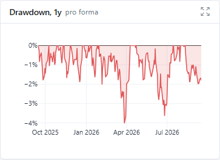

How far below its previous high the pro-forma book was on each day of the last year. Zero means at a new high. The deepest point, about −4%, was the April 2025 tariff shock.

### The same page for a concentrated book

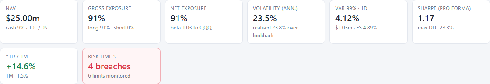

For comparison, the ten-stock Concentrated Growth book: 91% net long, no shorts, 23.5% volatility (three times the Flagship), beta 1.03 to QQQ, VaR 4.12% ($1.03m on $25m), and four broken limits. Same page, very different story.

> **Client question: "Why is the volatility 8.4% when my stocks are 30 to 50% volatile each?"**
> Because the book is hedged and diversified. Thirty positions that do not all move together, plus a 12% short in SPY and 31% of shorts overall, cancel a large part of each other's swings. The Decomposition page shows exactly which positions add risk and which remove it.

## 3.3 Positions

**What it is for.** The holdings ledger. See, edit, add, remove and import positions, and set the cash balance.

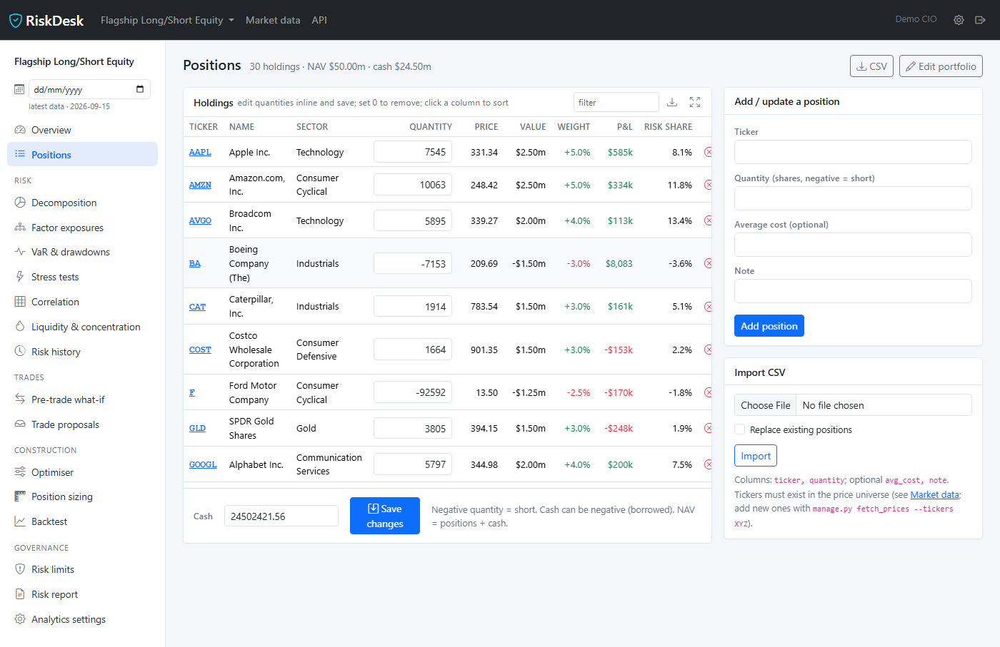

### Holdings table

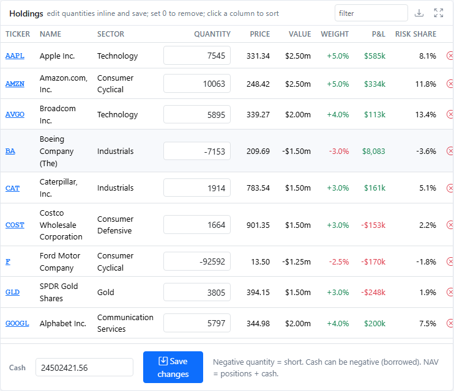

| Column | Meaning |
|---|---|
| Ticker | Click it to open the instrument page |
| Name, Sector | From the reference data loaded with prices |
| Quantity | Number of shares. **Editable in place.** Negative = short. Set to 0 and save to remove |
| Price | Latest close |
| Value | Quantity × price. Negative for shorts |
| Weight | Value ÷ NAV |
| P&L | (price − average cost) × quantity, if an average cost was recorded |
| Risk share | The position's share of portfolio volatility, same number as the Overview |
| ⓧ | Remove the position |

The **total row** shows the number of positions, cash, total market value and net weight. The **cash** box and **Save changes** button apply all edits at once.

### Add / update a position and Import CSV

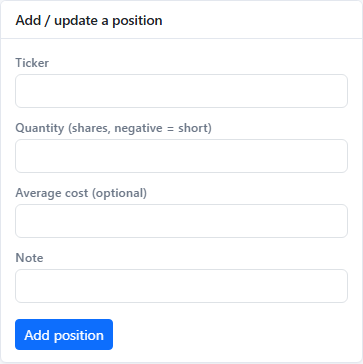 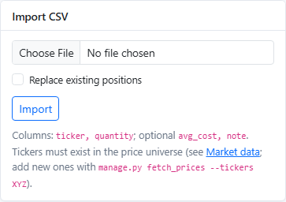

Type a ticker (the box suggests names from the price universe), a quantity, an optional average cost and note. To load a whole book, upload a CSV with columns `ticker, quantity` and optionally `avg_cost, note`. Tick *Replace existing positions* to start from a blank sheet. Tickers that are not in the price universe are reported and skipped; add them with the `fetch_prices` command described in [Part 8](#part-8--for-developers).

> **Client question: "Can it take our positions from our own system?"**
> Yes, three ways: the CSV upload here, the JSON API ([3.20](#320-the-api)), or a direct write into the database. Any of them can be scheduled to run daily.

## 3.4 Risk › Decomposition

**What it is for.** Splitting the portfolio's total volatility into the part each position, sector and asset class is responsible for. This is where "NVDA is 7% of the money but 24% of the risk" comes from.

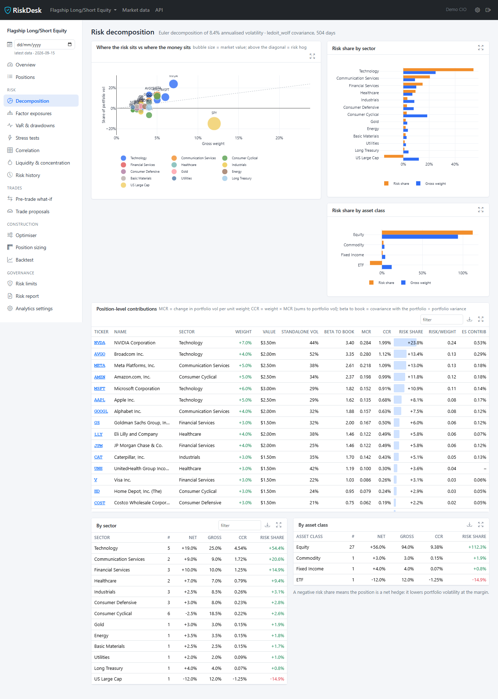

### Where the risk sits vs where the money sits

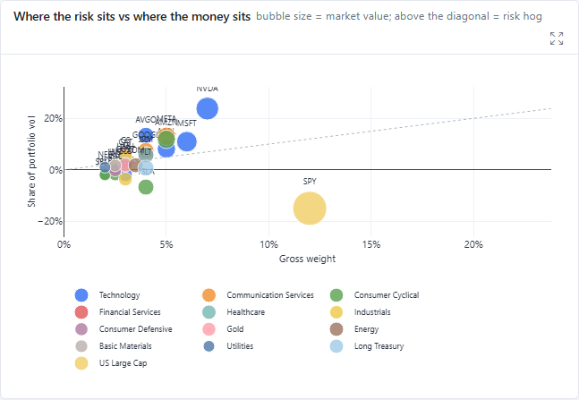

Each bubble is a position. Left to right is its share of the money (gross weight). Bottom to top is its share of the risk. Bubble size is market value, colour is sector. The dotted diagonal is where risk share equals money share. Anything **above the line is a risk hog**: it takes more than its fair share of risk. NVDA, AVGO, META and AMZN sit well above the line. Names near the bottom, like PG or TLT, are almost free in risk terms.

### Risk share by sector and by asset class

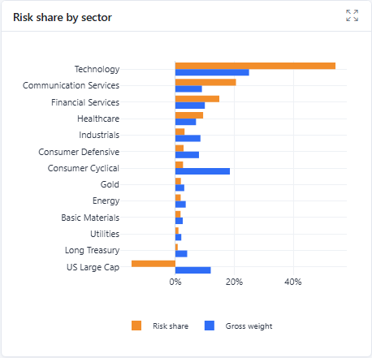 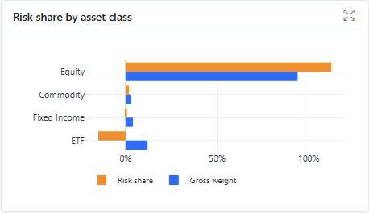

Orange is share of risk, blue is share of gross money. Technology: 25% of money, 54% of risk. The ETF hedge ("US Large Cap") has a negative risk share, meaning it removes about 15 points of risk.

### Position-level contributions

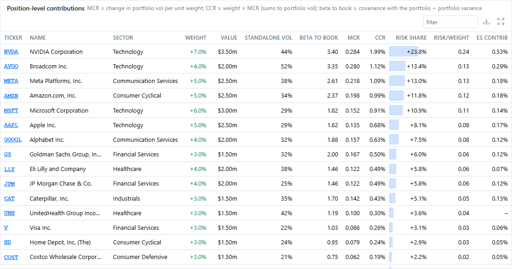

Every position, sorted by risk share. This is the master table.

| Column | Meaning | Example (NVDA) |
|---|---|---|
| Weight | Market value ÷ NAV | +7.0% |
| Value | Market value | $3.50m |
| Standalone vol | The stock's own annual volatility, alone | 44% |
| Beta to book | How much the stock moves when the whole portfolio moves 1%. Above 1 means it amplifies the book | 3.40 |
| MCR | Marginal contribution: change in portfolio vol per unit of extra weight | 0.284 |
| CCR | Component contribution: weight × MCR, in volatility points. All CCRs add up to the 8.4% total | 2.0 points |
| Risk share | CCR ÷ total vol | 23.8% |
| Risk/weight | Risk share ÷ weight share. Above 1 = risk hog | 3.4 |
| ES contrib | The position's average loss on the worst 1% of days, in % of NAV | 0.53% |

The bottom row reads: net weight 51%, total vol 8.4%, risk share 100%.

**The one-line rule behind the table:** risk share = weight × beta to book. NVDA: 7.0% × 3.40 = 23.8%. Because each stock's beta is weighted by its size, the shares always sum to exactly 100%. The full explanation with a worked example is in [4.3](#43-risk-contributions-euler-decomposition).

### By sector and By asset class (tables)

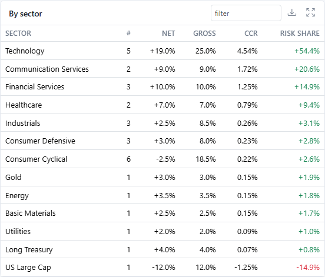 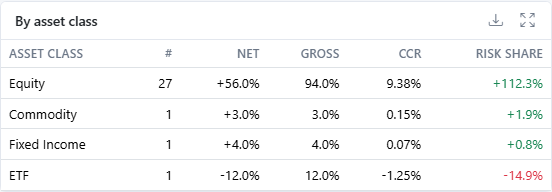

Net and gross weight, CCR and risk share for each group. A negative risk share means the group is a net hedge.

> **Client question: "If I sell all of NVDA, does risk fall by 23.8%?"**
> No. Risk shares describe *small* changes. Selling all of it changes every other stock's beta to the (now different) book. Use the What-if page for a large trade: it re-runs the whole calculation. See [4.3](#43-risk-contributions-euler-decomposition).

## 3.5 Risk › Factor exposures

**What it is for.** Finding out which broad market forces drive the book, and how much of the risk is "the market" versus stock-specific choices.

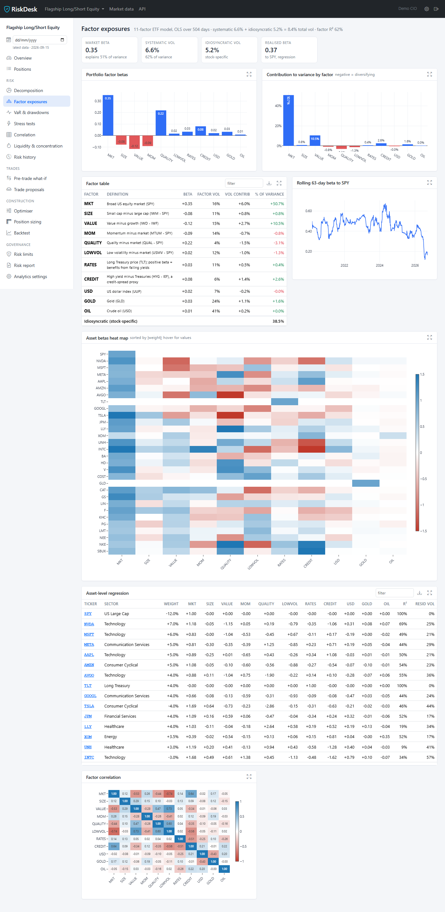

### What a factor is

A factor is a broad force that moves many stocks at once. RiskDesk uses eleven, each built from liquid ETFs so the model needs nothing but price data:

| Factor | Built from | What a positive beta means |
|---|---|---|
| MKT | SPY | The book rises when the US stock market rises |
| SIZE | IWM minus SPY | Rises when small companies beat large ones |
| VALUE | IWD minus IWF | Rises when cheap "value" stocks beat expensive "growth" stocks |
| MOM | MTUM minus SPY | Rises when recent winners keep winning |
| QUALITY | QUAL minus SPY | Rises when high-quality, profitable companies lead |
| LOWVOL | USMV minus SPY | Rises when calm, defensive stocks lead (usually risk-off periods) |
| RATES | TLT | Rises when long-dated Treasury *prices* rise, i.e. when yields fall |
| CREDIT | HYG minus IEF | Rises when high-yield bonds beat Treasuries (credit spreads tighten) |
| USD | UUP | Rises when the dollar strengthens |
| GOLD | GLD | Rises with gold |
| OIL | USO | Rises with crude oil |

Each stock is regressed on these eleven series over the lookback window. The portfolio's exposure to a factor is the weighted average of its stocks' exposures.

### The four cards

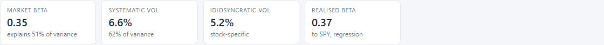

- **Market beta 0.35**, explaining 51% of variance. Variance is volatility squared; it is the unit in which risk pieces add up.
- **Systematic vol 6.6%**: the part of volatility explained by the eleven factors. 62% of the variance.
- **Idiosyncratic vol 5.2%**: the part specific to the individual stocks, which is what a stock-picker is paid for.
- **Realised beta 0.37**: the simple regression of the book's pro-forma returns on SPY. It agrees with the model's 0.35.

The two parts combine as squares: 6.6² + 5.2² ≈ 8.4², the total volatility.

### Portfolio factor betas and Contribution to variance by factor

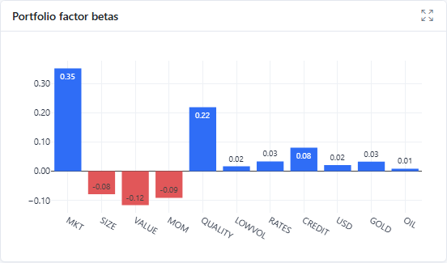 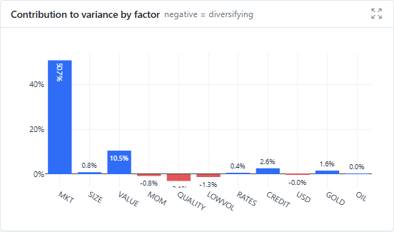

The left chart is the exposure. The right chart is how much of the total variance each factor explains, which depends on both the exposure and how volatile the factor is. MKT is 51%. VALUE is −0.12 exposure and 10.5% of variance: the book is tilted toward growth. QUALITY has a positive beta but a *negative* variance share (−3.1%), which means the quality tilt is diversifying: it tends to move against the rest of the book's exposures.

### Factor table

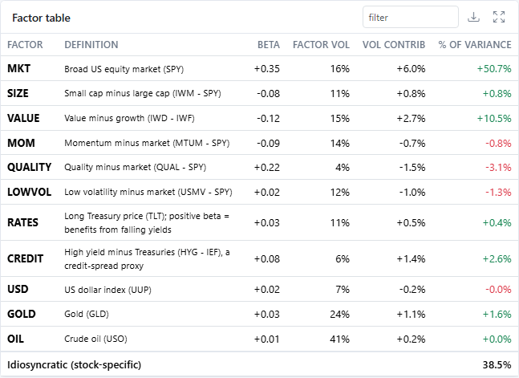

| Column | Meaning |
|---|---|
| Beta | Exposure to the factor |
| Factor vol | How volatile the factor itself is. OIL is 41% a year, QUALITY only 4% |
| Vol contrib | The factor's contribution in volatility points |
| % of variance | Its share of total variance. The rows plus the idiosyncratic row sum to 100% |

### Rolling 63-day beta to SPY

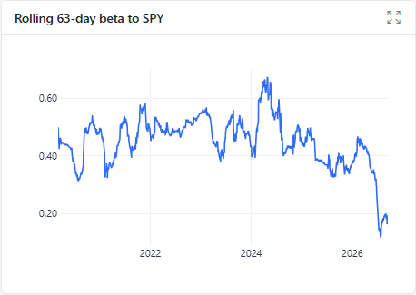

The market beta measured over a sliding three-month window. It shows whether the hedge has kept the book's market sensitivity steady. Flagship's beta has moved between about 0.2 and 0.7 over the years and is near 0.2 today.

### Asset betas heat map and Asset-level regression

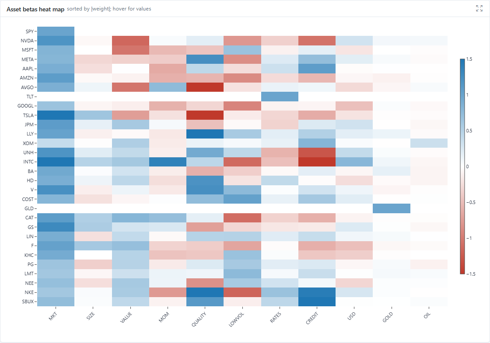

Every position (rows) against every factor (columns). Blue is positive, red negative. Hover for values. You can see at a glance that the semiconductor names are deep red on VALUE (they are growth stocks) and that TLT is a single blue cell on RATES.

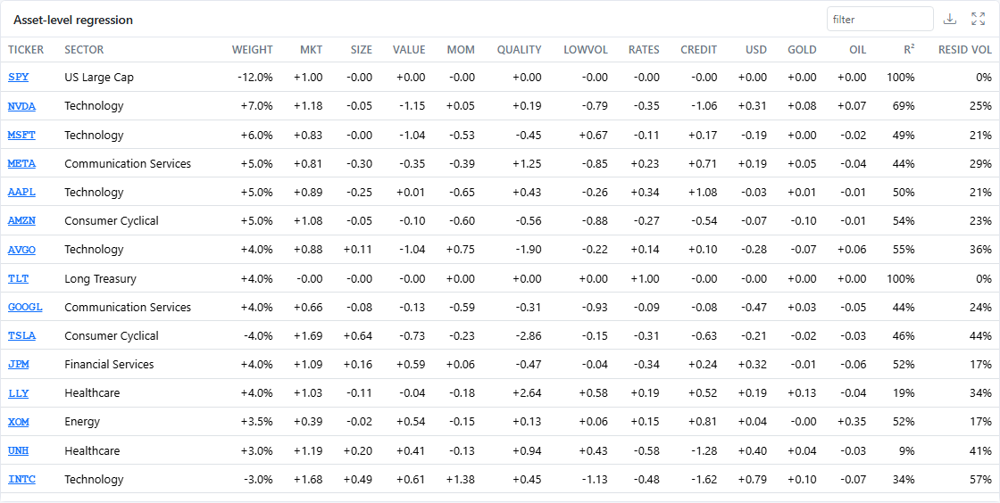

The numbers behind the heat map, plus two quality measures per stock: **R²**, the share of the stock's movement the factors explain (NVDA 69%, SPY 100%), and **Resid vol**, the leftover stock-specific volatility (NVDA 25%).

### Factor correlation

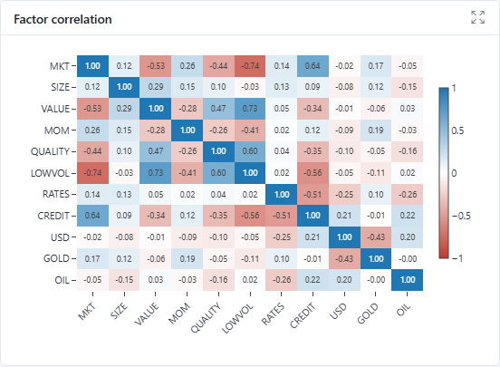

How the factors move with each other. MKT and CREDIT are positively correlated (0.64): when stocks fall, credit spreads widen. VALUE and LOWVOL are positively correlated (0.73). This matters because two exposures to correlated factors are less diversifying than they look.

> **Client question: "Is this a stock-picking book or a market bet?"**
> 62% of variance is factor-driven and 38% is stock-specific, so it is both, with the market beta of 0.35 as the largest single exposure. If the mandate is pure stock selection, the insight engine would suggest hedging the factor exposures to let idiosyncratic risk dominate.

## 3.6 Risk › VaR & drawdowns

**What it is for.** How much the book can lose on a bad day (Value at Risk), how bad the really bad days are (Expected Shortfall), how the losses have clustered (drawdowns), and the shape of the return distribution.

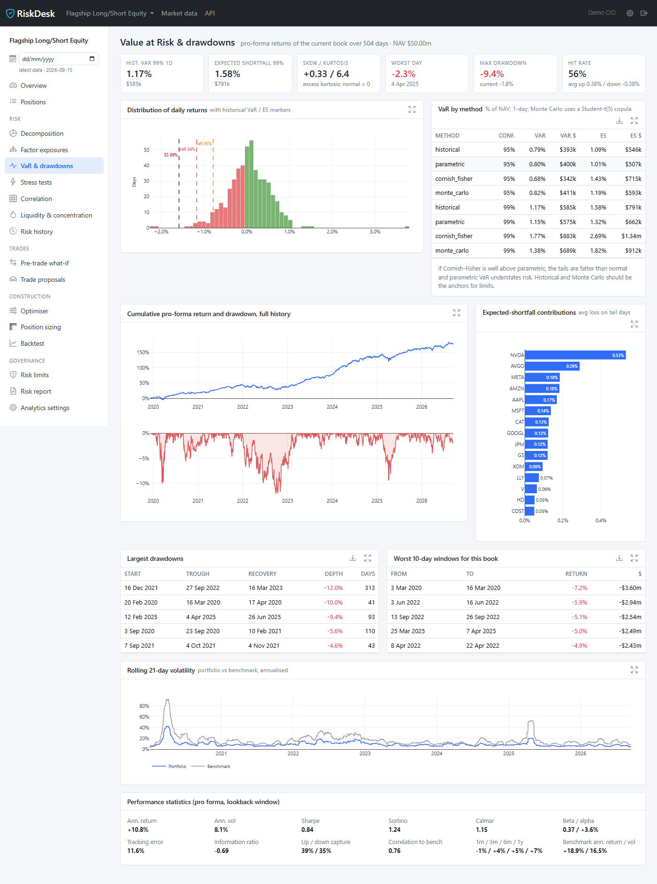

### The six cards

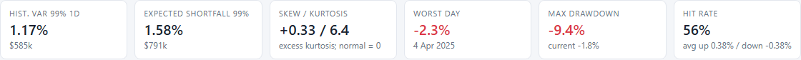

| Card | Meaning | Value |
|---|---|---|
| Hist. VaR 99% 1d | On 99 days in 100 the one-day loss stays below this | 1.17%, $585k |
| Expected shortfall 99% | Average loss on the 1 day in 100 that breaks the VaR line | 1.58%, $791k |
| Skew / kurtosis | Skew: whether big moves lean up (+) or down (−). Kurtosis: how fat the tails are; a bell curve is 0 | +0.33 / 6.4. The tails are fat |
| Worst day | The worst single pro-forma day in the window | −2.3% on 4 April 2025 |
| Max drawdown | The deepest peak-to-trough fall | −9.4%, currently −1.8% below the high |
| Hit rate | Share of days that were positive | 56%, average up day +0.38%, average down day −0.38% |

### Distribution of daily returns

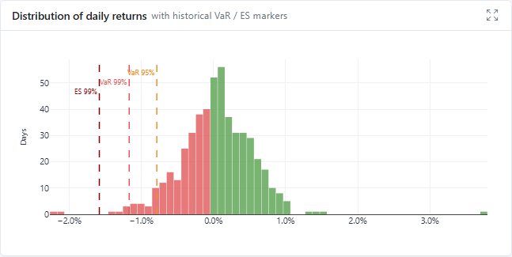

A histogram of the 504 daily pro-forma returns. Green bars are up days, red bars are down days. The dashed lines mark historical VaR at 95%, VaR at 99% and ES at 99%. You can see the fat left tail: a handful of days far to the left of the main body.

### VaR by method

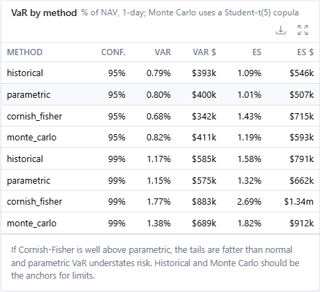

Four ways of estimating the same thing, at two confidence levels. Full explanation in [4.4](#44-value-at-risk-and-expected-shortfall); in brief:

| Method | How it works | 99% VaR | 99% ES |
|---|---|---|---|
| historical | Sort the actual 504 daily returns and read off the 1st percentile | 1.17% | 1.58% |
| parametric | Assume a bell curve; VaR is 2.33 standard deviations | 1.15% | 1.32% |
| cornish_fisher | Bell curve bent by the measured skew and kurtosis | 1.77% | 2.69% |
| monte_carlo | Simulate 20,000 days from the covariance matrix with a fat-tailed (Student-t) distribution | 1.38% | 1.82% |

**How to read the disagreement.** When Cornish-Fisher sits well above parametric (1.77% vs 1.15%), the bell curve is understating the tail. Historical and Monte Carlo are the numbers to anchor limits on. The headline VaR used on the Overview and in the limits is historical.

### Cumulative pro-forma return and drawdown, full history

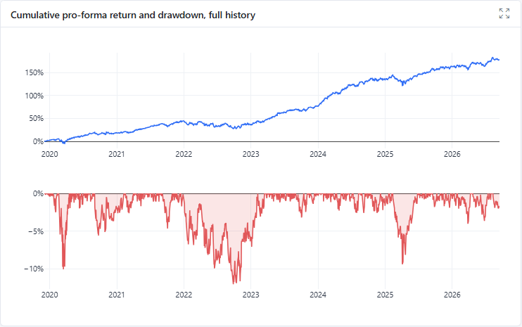

The top line is the growth of today's book since December 2019 (about +160%). The bottom chart is the drawdown on each day: how far below the previous high. The three deep red troughs are COVID (March 2020), the 2022 bear market, and the April 2025 tariff shock.

### Expected-shortfall contributions

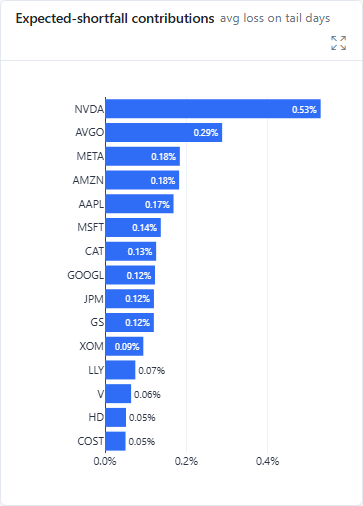

Which positions lose the most on the worst 1% of days. NVDA contributes 0.53% of NAV to the 1.58% ES, AVGO 0.29%. This is a *tail* view of risk, which can differ from the volatility view when a position only misbehaves in crises.

### Largest drawdowns and Worst 10-day windows

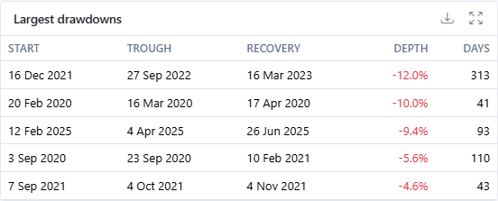 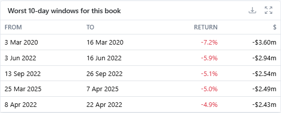

Drawdown episodes with start, trough, recovery date, depth and length. The 2022 episode lasted 313 days and reached −12.0%. An episode still under way would show an "ongoing" badge. The worst two-week windows table finds the ten-day stretches that hurt most: 3 to 16 March 2020 lost 7.2%, $3.60m at today's size.

### Rolling 21-day volatility

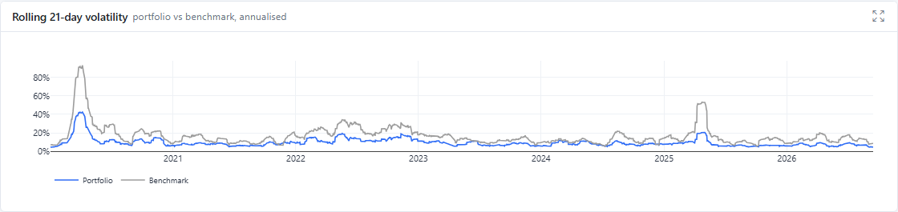

Volatility measured over a sliding one-month window, book (blue) against benchmark (grey). The book's volatility is consistently a fraction of the index's, and the spikes in March 2020 and April 2025 show how quickly risk can double.

### Performance statistics

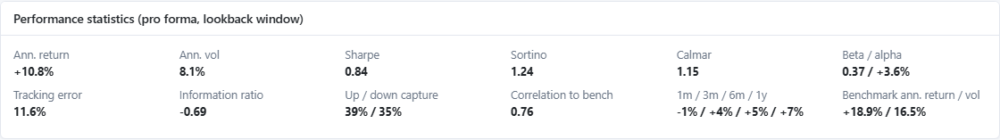

| Statistic | Meaning | Value |
|---|---|---|
| Ann. return / vol | Yearly return and volatility over the window | +10.8% / 8.1% |
| Sharpe | (return − 4% cash rate) ÷ vol | 0.84 |
| Sortino | Like Sharpe but only penalises downside volatility | 1.24 |
| Calmar | Annual return ÷ max drawdown | 1.15 |
| Beta / alpha | Sensitivity to SPY, and the yearly return not explained by SPY | 0.37 / +3.6% |
| Tracking error | Volatility of the gap between book and benchmark | 11.6% |
| Information ratio | Excess return over benchmark ÷ tracking error. Negative here because a hedged book lagged a strong index | −0.69 |
| Up / down capture | How much of the index's up days and down days the book captured | 39% / 35% |
| Correlation to bench | 0.76 |
| 1m / 3m / 6m / 1y | Trailing returns | −1% / +4% / +5% / +7% |

> **Client question: "Which VaR should we put in the mandate?"**
> Historical at 99% one-day, which is the headline, with Expected Shortfall alongside it. The parametric figure is shown for comparison only, because the kurtosis of 6.4 says the bell curve does not fit this book.

## 3.7 Risk › Stress tests

**What it is for.** Answering "what happens to today's book in a crisis?" two ways: replaying real crises, and applying shocks you design.

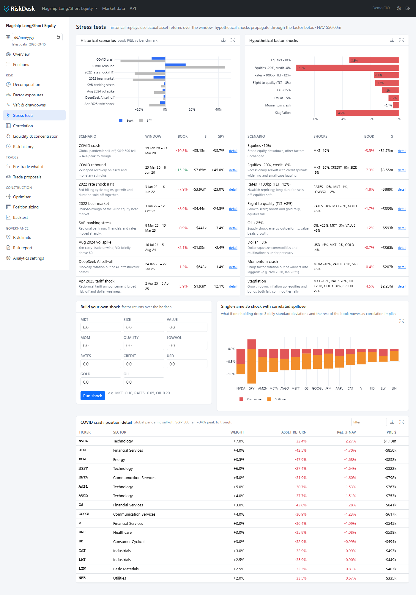

### Historical scenarios

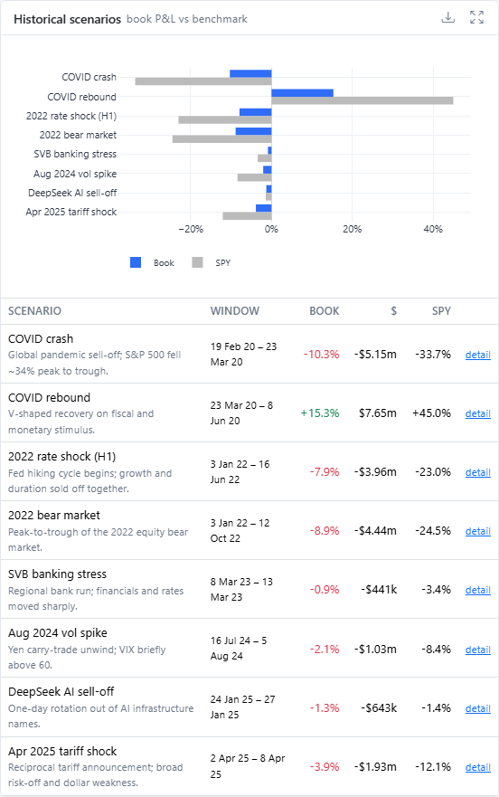

Eight real market episodes. For each, RiskDesk takes every holding's actual price change over that window and applies it to today's position sizes. Blue bars are the book, grey bars are SPY.

| Scenario | Window | Book | SPY |
|---|---|---|---|
| COVID crash | 19 Feb to 23 Mar 2020 | −10.3% ($5.15m) | −33.7% |
| COVID rebound | 23 Mar to 8 Jun 2020 | +15.3% | +45.0% |
| 2022 rate shock (H1) | 3 Jan to 16 Jun 2022 | −7.9% | −23.0% |
| 2022 bear market | 3 Jan to 12 Oct 2022 | −8.9% | −24.5% |
| SVB banking stress | 8 to 13 Mar 2023 | −0.9% | −3.4% |
| Aug 2024 vol spike | 16 Jul to 5 Aug 2024 | −2.1% | −8.4% |
| DeepSeek AI sell-off | 24 to 27 Jan 2025 | −1.3% | −1.4% |
| Apr 2025 tariff shock | 2 to 8 Apr 2025 | −3.9% | −12.1% |

The book loses roughly a third of what the index loses in each crash, consistent with its 0.37 beta. The exception is the DeepSeek sell-off, where the book fell almost as much as the index because that episode hit AI names specifically.

If a holding did not exist during a window (a recent IPO, say), its return is filled in from its factor betas and the badge "beta-filled" appears in the detail table, so newer names are still stressed rather than ignored.

### Hypothetical factor shocks

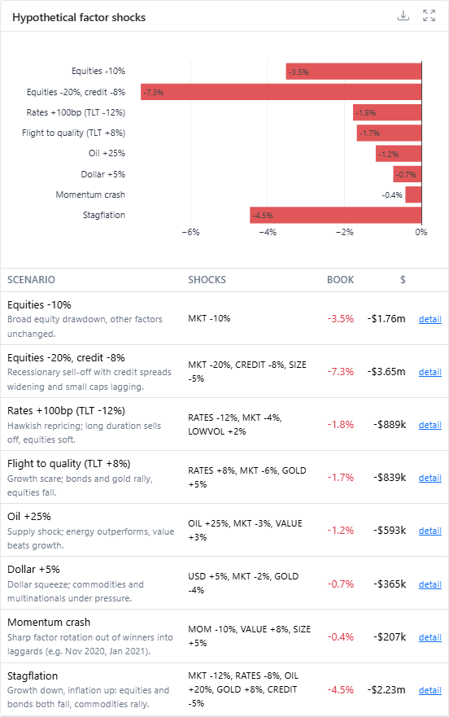

Eight designed scenarios expressed as factor moves. Each holding's response is worked out from its factor betas, so the shock reaches every stock in a consistent way.

| Scenario | Shocks | Book |
|---|---|---|
| Equities −10% | MKT −10% | −3.5% |
| Equities −20%, credit −8% | MKT −20%, CREDIT −8%, SIZE −5% | −7.3% |
| Rates +100bp | TLT −12%, MKT −4% | −1.8% |
| Flight to quality | TLT +8%, MKT −6%, GOLD +5% | −1.7% |
| Oil +25% | OIL +25%, MKT −3%, VALUE +3% | −1.2% |
| Dollar +5% | USD +5%, MKT −2%, GOLD −4% | −0.7% |
| Momentum crash | MOM −10%, VALUE +8%, SIZE +5% | −0.4% |
| Stagflation | MKT −12%, RATES −8%, OIL +20%, GOLD +8%, CREDIT −5% | −4.5% |

### Build your own shock

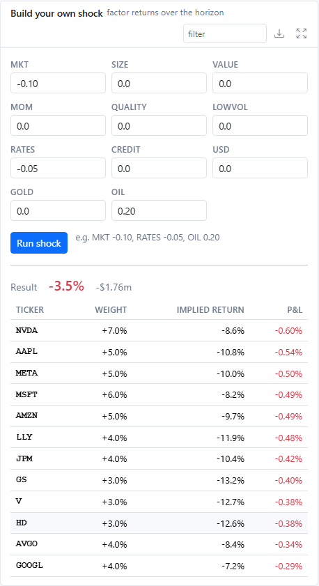

Type factor moves and press *Run shock*. The example shown is market −10%, long Treasuries −5%, oil +20%: the book loses 3.5%, $1.76m. The table underneath shows each holding's implied return and contribution, so you can see that LLY and GS are hit hardest per dollar because of their factor loadings.

### Single-name 3σ shock with correlated spillover

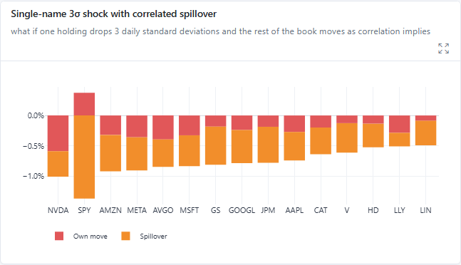

"What if one holding drops three standard deviations today?" The red part of each bar is the loss from that stock alone. The orange part is the *spillover*: the expected move in every other holding, worked out from the correlations. NVDA falling 8.4% (its three-sigma move) costs 0.59% directly and another 0.42% through the rest of the book, 1.01% in total. Notice the SPY bar: a 3.1% SPY fall *makes* money on the short (red part positive) but the spillover into the longs is −1.37%, so the net is still a loss.

### Scenario detail

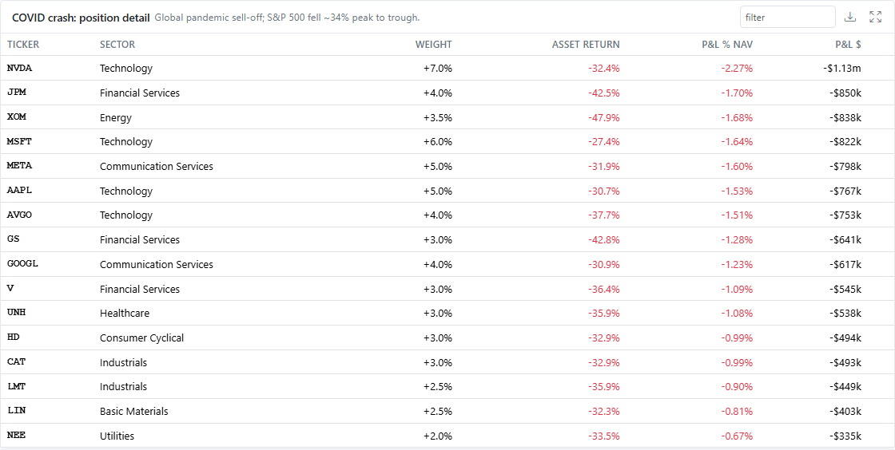

Click *detail* on any scenario to see it position by position: weight, the asset's return over the window, and its contribution in % of NAV and in dollars.

> **Client question: "Why does the book only lose 10% in COVID when the market lost 34%?"**
> Because 31% of the book is short and it carries a 12% SPY hedge. Shorts made money in the crash. The scenario detail table shows the SPY line contributing a positive number.

## 3.8 Risk › Correlation

**What it is for.** Checking whether the thirty positions are really thirty different bets, or a few bets in disguise.

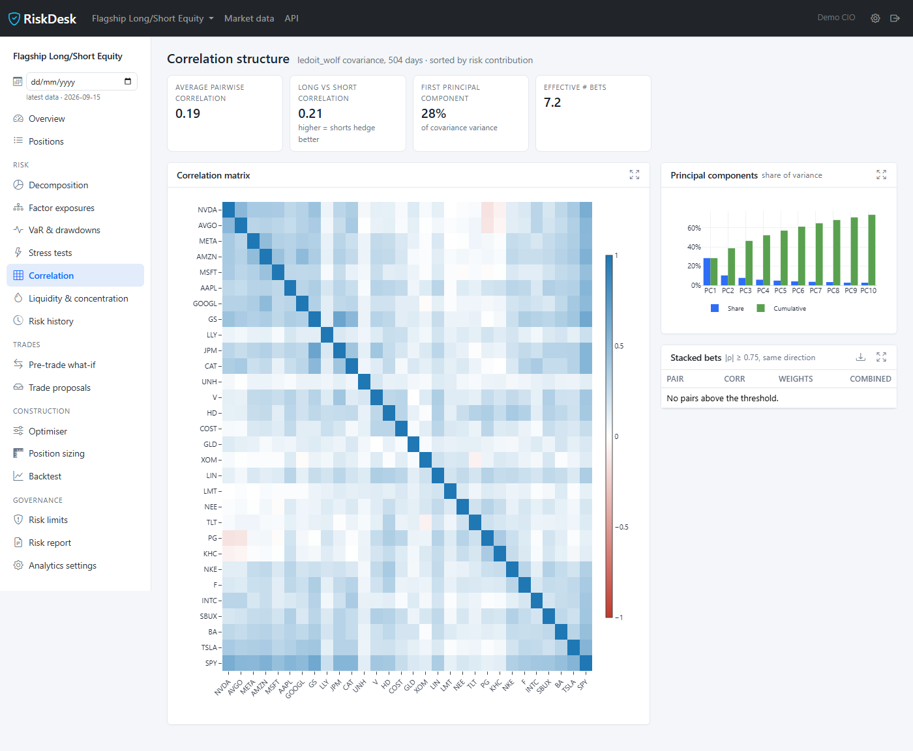

### The four cards

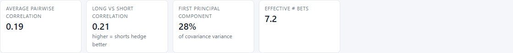

- **Average pairwise correlation 0.19.** Correlation runs from −1 (always move opposite) through 0 (unrelated) to +1 (always move together). 0.19 on average is a reasonably diversified book.
- **Long vs short correlation 0.21.** The average correlation between the long names and the short names. Higher is better for a hedge, because shorts that move with the longs offset them.
- **First principal component 28%.** If you had to summarise all the co-movement with one "super-factor", it would explain 28% of the variance. A book that was one big bet would show 70% or more.
- **Effective number of bets 7.2.** Thirty positions behave like about seven independent bets. Explained in [4.7](#47-concentration-and-liquidity-measures).

### Correlation matrix

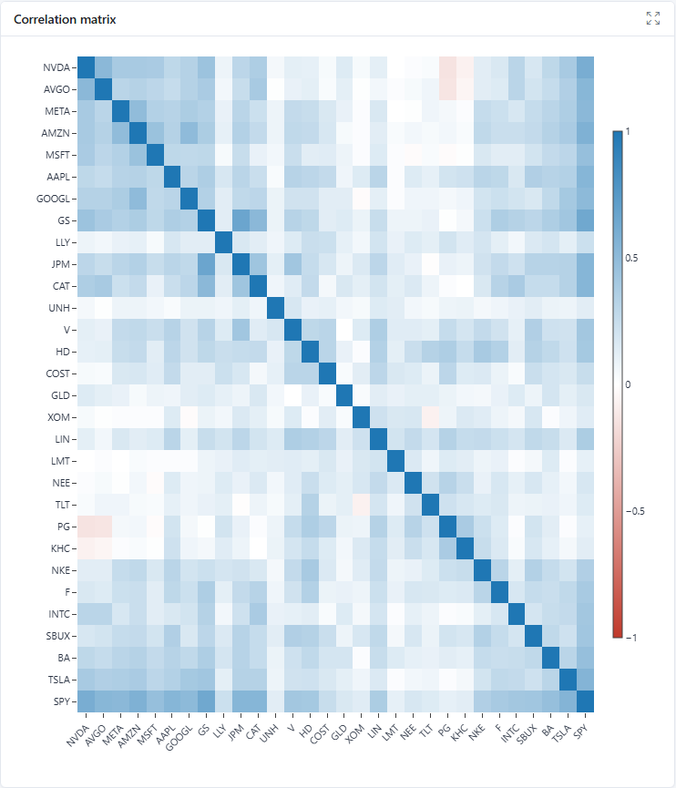

Every position against every other, sorted by risk contribution. Blue is positive, red negative, white is zero. The top-left block of semiconductor and mega-cap names is a solid blue square, which is the visual reason those names carry so much risk: they move together.

### Principal components and Stacked bets

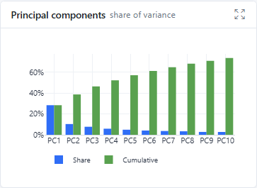 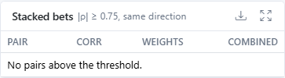

The blue bars are how much variance each successive "super-factor" explains, green is the running total: the first five explain about 60%. The stacked-bets table lists any pair with correlation above 0.75 held in the same direction. None in this book; in a book with, say, both GOOGL and META long at 0.8 correlation, they would appear here with the advice to size them as one position.

## 3.9 Risk › Liquidity & concentration

**What it is for.** Two questions: how fast could we get out, and how concentrated is the book?

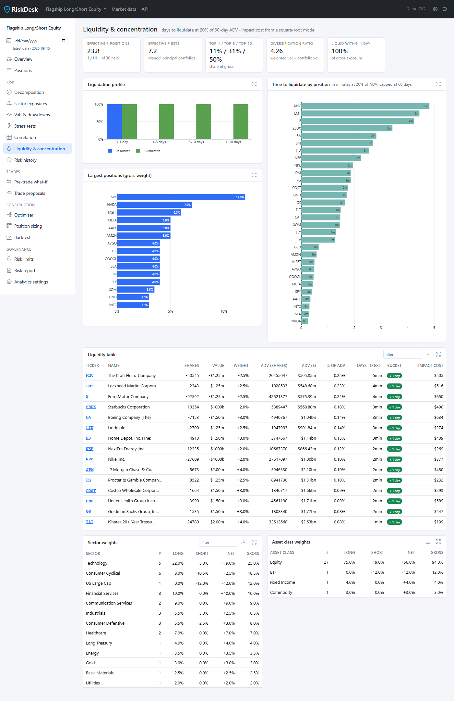

### The five cards

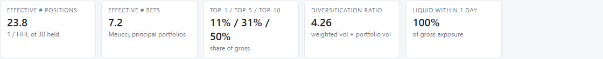

| Card | Meaning | Value |
|---|---|---|
| Effective # positions | If all positions were equal-sized, how many would give this concentration. 1 ÷ HHI | 23.8 of 30 held |
| Effective # bets | How many *independent* bets the book behaves like, accounting for correlation | 7.2 |
| Top-1 / top-5 / top-10 | Share of gross money in the largest 1, 5 and 10 positions | 11% / 31% / 50% |
| Diversification ratio | Weighted average of the stocks' own volatilities ÷ portfolio volatility. 1 means no diversification benefit; higher is better | 4.26 |
| Liquid within 1 day | Share of gross exposure that could be sold in a day | 100% |

### Liquidation profile and Time to liquidate by position

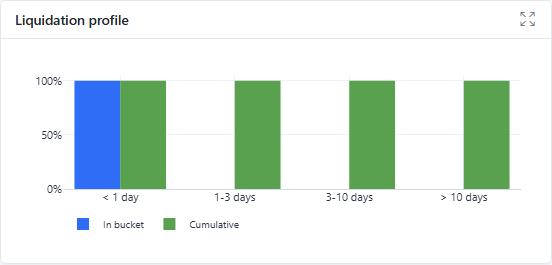 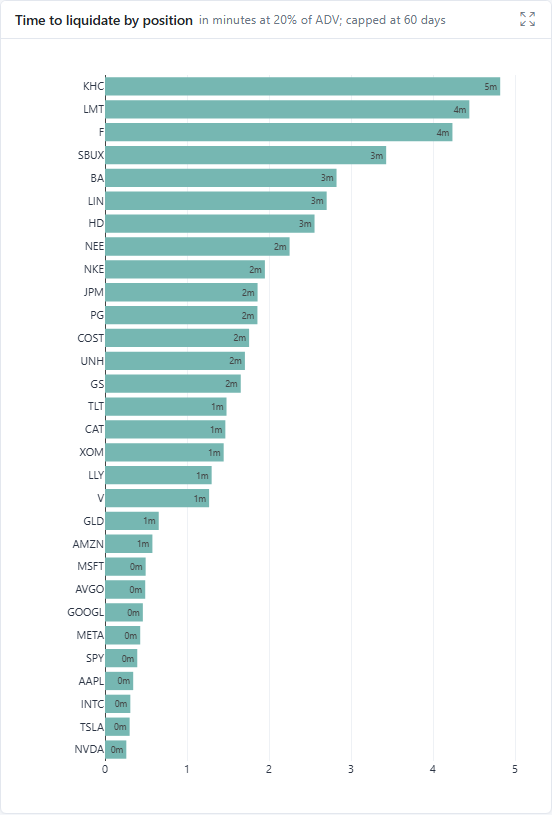

Days to liquidate = shares held ÷ (average daily volume × 20%). The 20% is the share of a day's volume you can trade without moving the price much; it can be changed in Analytics settings. For a $50m book in mega-cap names every position exits in minutes, so the chart is labelled in minutes. For a book in small-caps the same chart would show days.

### Liquidity table

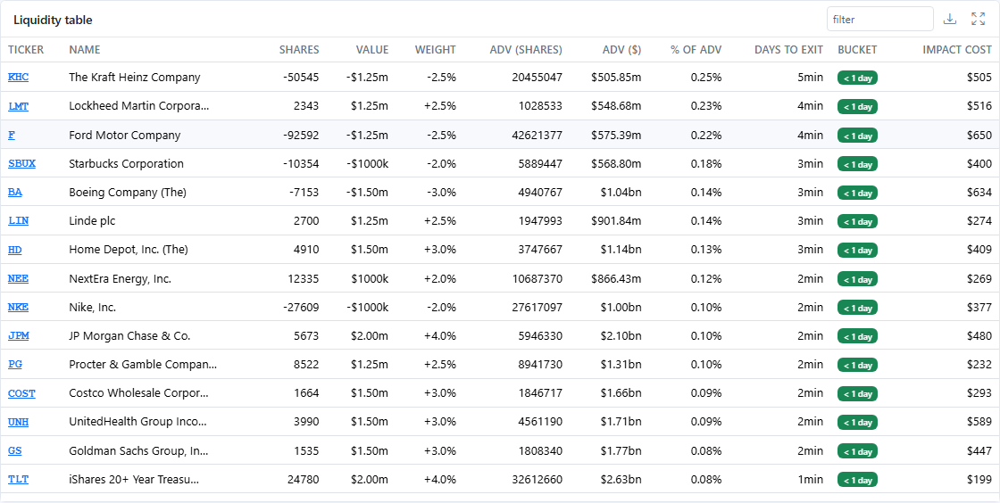

| Column | Meaning |
|---|---|
| ADV (shares), ADV ($) | Average daily volume over 30 days, in shares and dollars |
| % of ADV | The position as a share of one day's volume |
| Days to exit | At 20% participation |
| Bucket | < 1 day, 1–3 days, 3–10 days, > 10 days |
| Impact cost | Rough estimate of the price impact of selling: half the daily volatility times the square root of participation, times value. About $500 per position here |

### Largest positions, Sector weights, Asset class weights

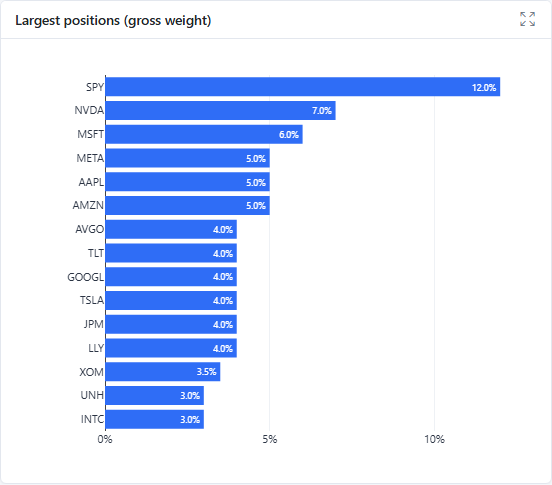

The ten biggest positions by gross weight. SPY is the largest at 12% (the hedge), then NVDA 7% and MSFT 6%.

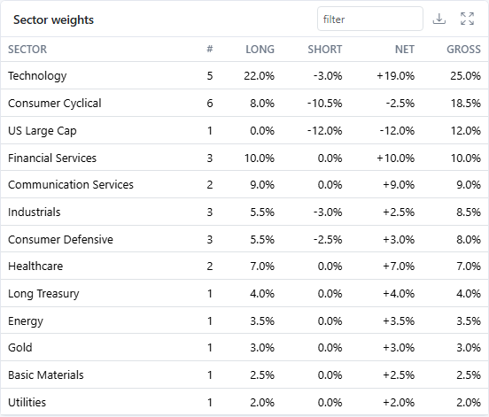 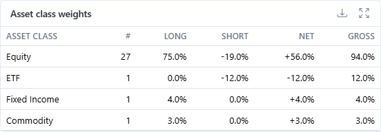

Long, short, net and gross weight per sector and per asset class. Equity is 75% long, 19% short; the ETF line is the 12% SPY short; fixed income 4% (TLT) and commodity 3% (GLD).

> **Client question: "Our book is in mid-caps. Will this still work?"**
> Yes, and it becomes more interesting. The same chart switches from minutes to hours or days automatically, and the *Days to liquidate* limit and the liquidity insight rule start to fire.

## 3.10 Risk › Risk history

**What it is for.** Seeing how the book's risk has drifted day by day, and whether the VaR model is being exceeded as often as it should.

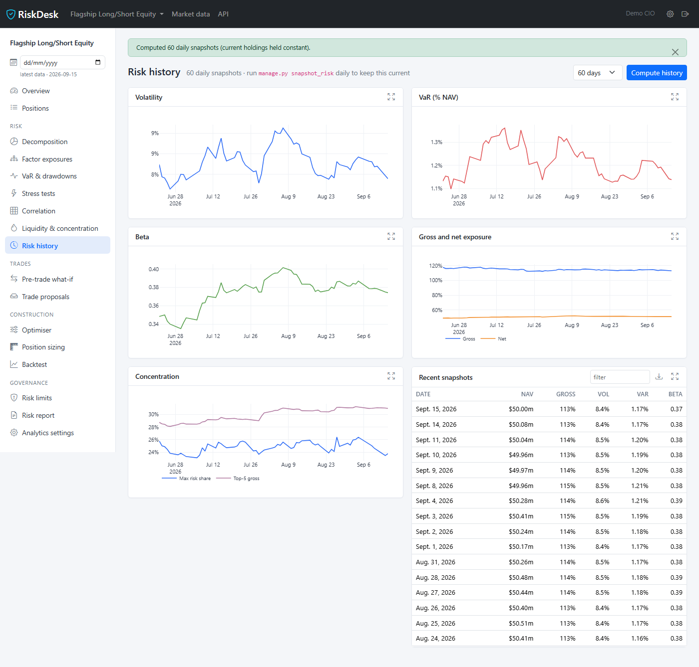

The page shows daily snapshots of volatility, VaR, beta, gross and net exposure and concentration. Snapshots are recorded by the `snapshot_risk` command (meant to run daily), or back-filled from price history with the *Compute history* button, which holds today's positions constant.

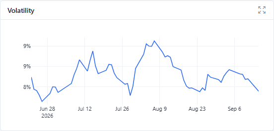 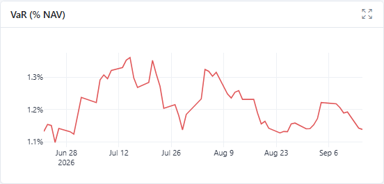

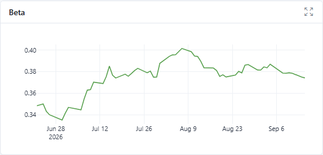 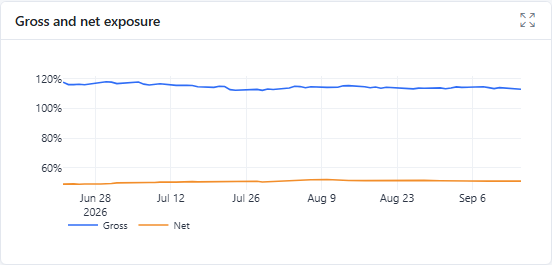

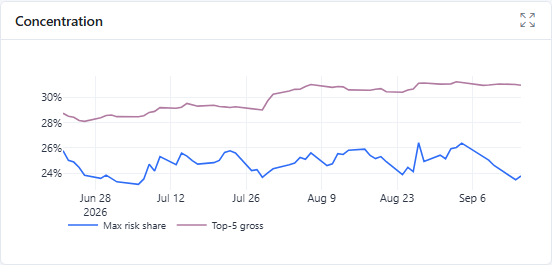 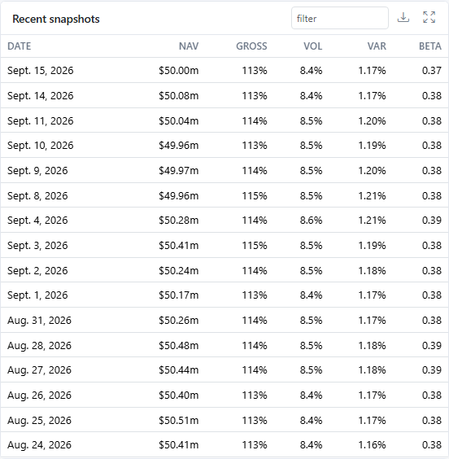

The table shows the last thirty days: NAV around $50m, gross 113 to 115%, vol 8.4 to 8.6%, VaR 1.16 to 1.21%, beta 0.37 to 0.39. A CIO reads this for trend, and a risk manager uses the VaR series to count how many days the actual loss exceeded the VaR (there should be about two or three a year at 99%).

## 3.11 Trades › Pre-trade what-if

**What it is for.** The most important page for an investment-facing risk seat. Type the trades you are thinking about, and see the whole book before and after, checked against every limit, *before* the order goes out.

### The empty page

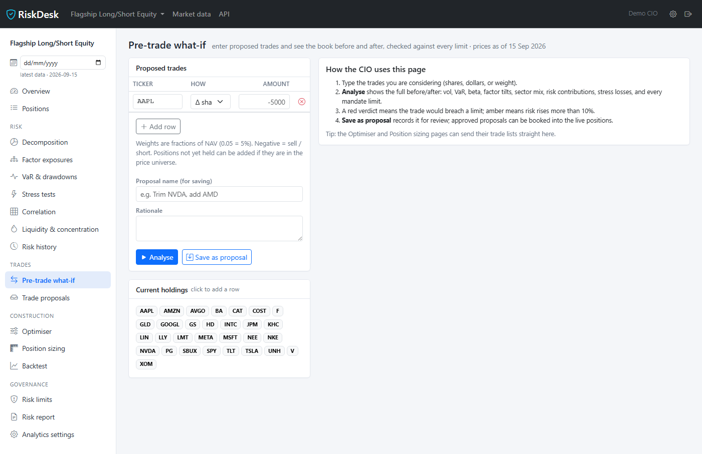

The left card is the trade sheet. Each row has a ticker, a *how* and an amount:

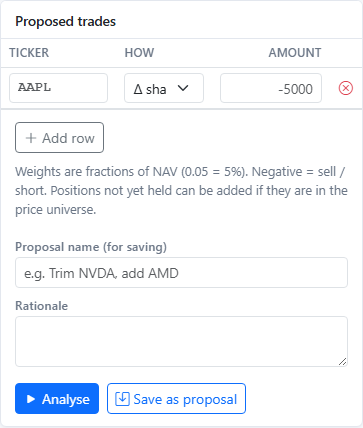

| How | Meaning | Example |
|---|---|---|
| Δ shares | Buy (+) or sell (−) this many shares | −5000 |
| Δ dollars | Buy or sell this many dollars' worth | −1000000 |
| Δ weight | Change the weight by this fraction of NAV | −0.03 for "cut by 3% of NAV" |
| Target weight | Set the weight to exactly this fraction of NAV | 0.04 for "make it 4% of NAV" |

Click a ticker chip under *Current holdings* to add a row for it. New names can be added if they are in the price universe. Give the proposal a name and a rationale if you plan to save it.

### With results

The example trade: take NVDA down to a 4% target weight and add AMD at 3% of NAV.

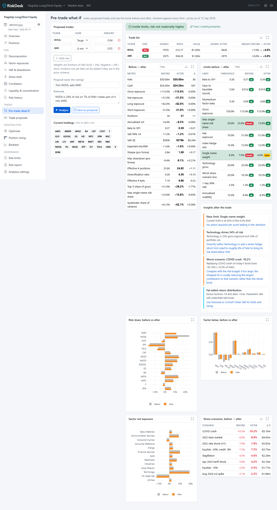

**The verdict** at the top is the one-line answer: green *"Inside limits, risk not materially higher"*, amber *"Inside limits but risk rises > 10%"*, or red *"Creates N new limit breaches"*. A second note reports breaches the trade *fixes*. This trade is green and fixes both existing breaches.

**Trade list**

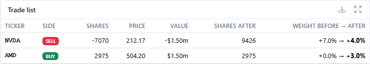

The trades converted to shares at the latest price: sell 7,070 NVDA at $212.17 ($1.50m), leaving 9,426 shares, weight 7.0% → 4.0%; buy 2,975 AMD at $504.20 ($1.50m), weight 0% → 3.0%.

**Before → after**

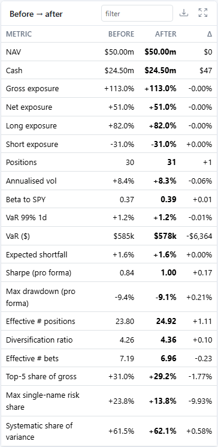

Twenty metrics side by side. Reading the interesting rows: annualised vol 8.4% → 8.3%; beta 0.37 → 0.39; VaR $585k → $578k; Sharpe 0.84 → 1.00; max drawdown −9.4% → −9.1%; effective number of positions 23.8 → 24.9; top-5 share 31.0% → 29.2%; max single-name risk share 23.8% → 13.8%. Green deltas are improvements, red are deteriorations.

**Limits before → after**

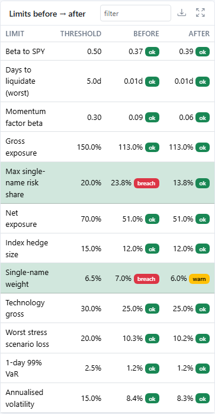

Every limit re-checked. Rows shaded green are breaches the trade fixes; red rows would be new breaches. *Max single-name risk share* goes from breach to ok; *Single-name weight* goes from breach (7.0%) to warn (6.0% against 6.5%, which is over 90% utilisation).

**Insights after the trade, and the three comparison charts**

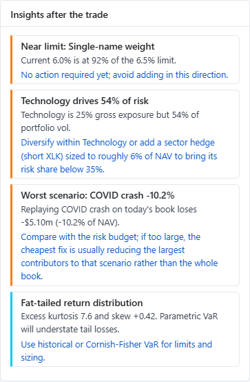

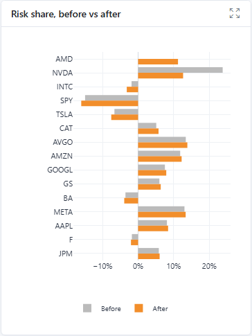 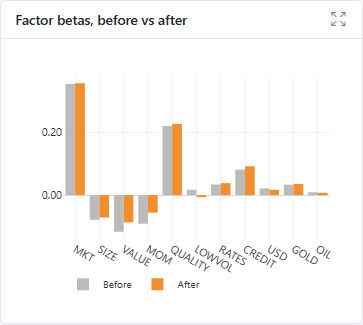

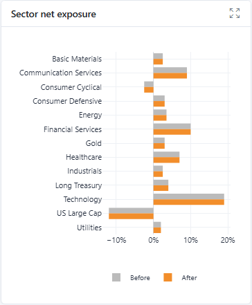 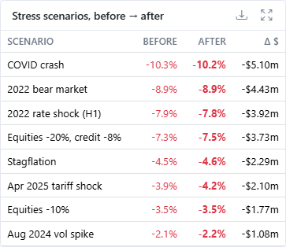

Grey is before, orange after. NVDA's risk share halves; AMD appears at about 7%. Factor betas barely move. Every stress scenario improves slightly (COVID crash −10.3% → about −9.7%).

**Save as proposal** stores the trades, the rationale, and a snapshot of before/after for the audit trail, then opens the proposal page.

> **Client question: "How long does the analysis take?"**
> Under a second. The whole book is re-priced and every metric re-computed on each click, which is why the same engine can also be called from the API by a trading system before an order is released.

## 3.12 Trades › Trade proposals

**What it is for.** The record of every proposed change: what was proposed, why, what it did to risk at the time, and whether it was approved.

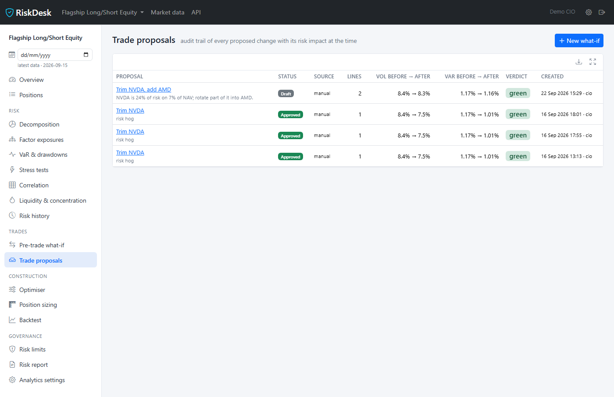

Each row shows the proposal name and rationale, its status (draft, in review, approved, rejected, executed), where it came from (manual, optimiser, sizing), the number of trade lines, vol and VaR before → after at creation, the verdict, and who created it.

### Proposal detail

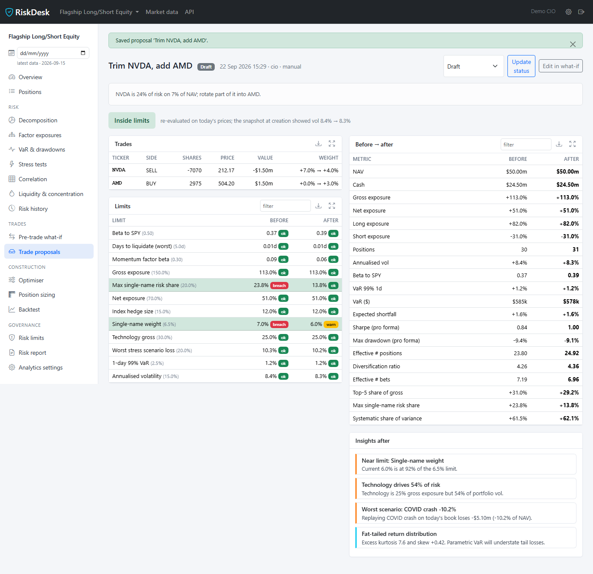

The proposal is **re-evaluated on today's prices** every time you open it, and the snapshot from creation is shown for comparison. The status dropdown moves it through the workflow. *Edit in what-if* reopens it for changes. Once a proposal is **approved**, a green **Book trades** button appears: it applies the trades to the live positions at the latest close, adjusts cash, and marks the proposal executed.

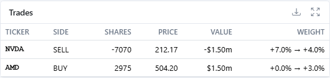 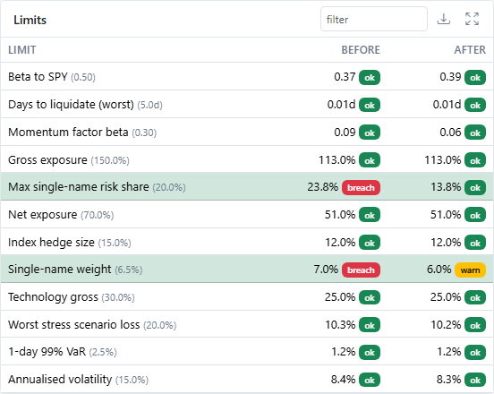

> **Client question: "Can two people work on this?"**
> Yes. Proposals carry the creator's name, the status workflow is shared, and the admin site manages users and permissions.

## 3.13 Construction › Optimiser

**What it is for.** Asking a solver "given my constraints, what weights are best?" and turning the answer into a trade list you can test in the what-if page. The screenshots use the Multi-Asset Balanced book because a long-only ETF universe gives the cleanest illustration.

### The form

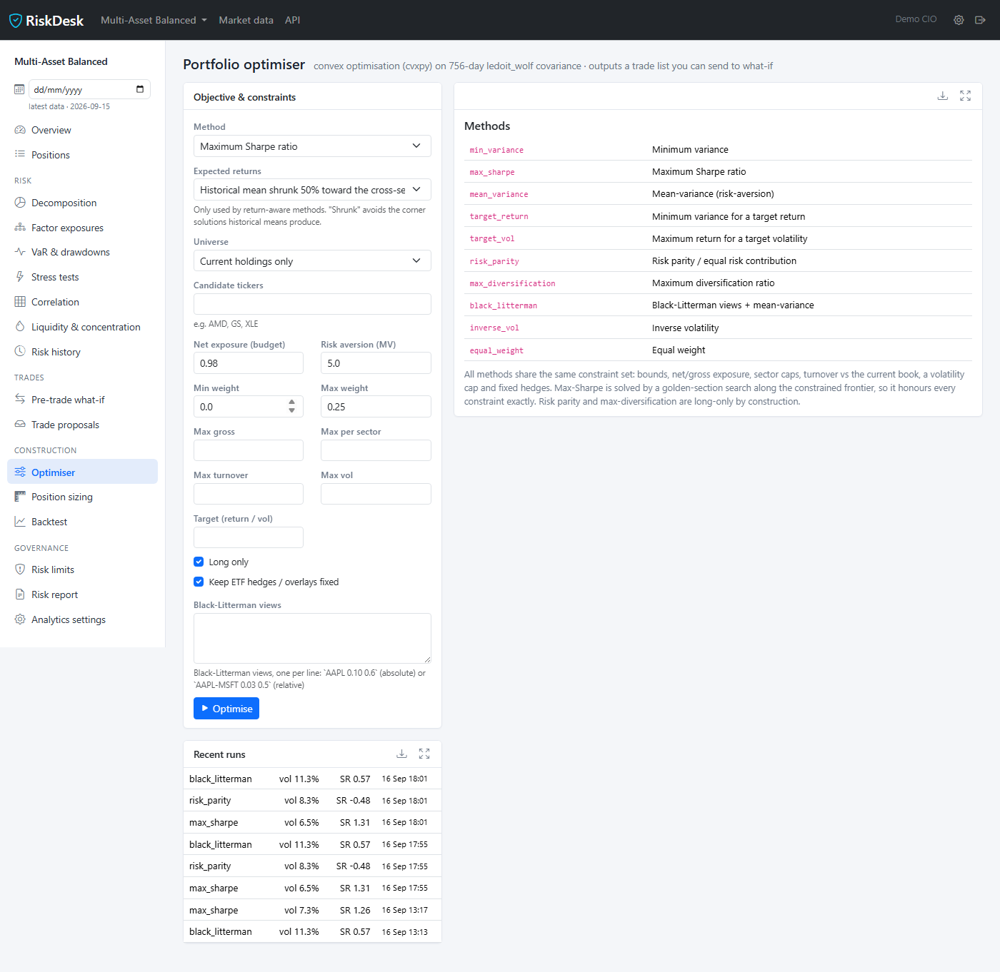

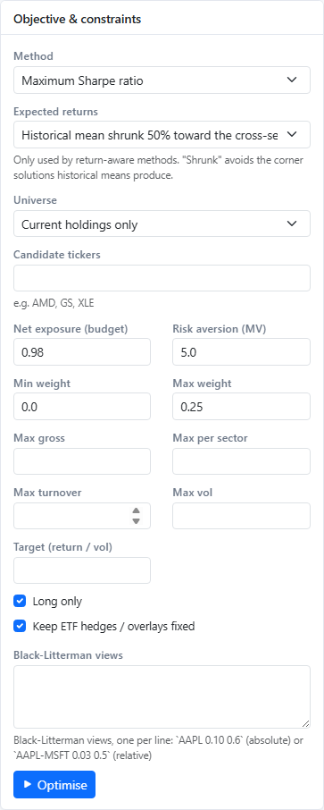

| Setting | Meaning |
|---|---|
| Method | The objective. See the table below |
| Expected returns | How to estimate each asset's future return, only used by return-aware methods. "Shrunk" pulls each asset's historical average halfway toward the average of all assets, which stops the optimiser from piling into whatever happened to do best recently |
| Universe | Current holdings only, or holdings plus candidate tickers you list |
| Net exposure (budget) | What the weights must sum to. 1.0 = fully invested |
| Min / max weight | Per-asset bounds. A negative minimum allows shorts |
| Max gross, Max per sector, Max turnover, Max vol | Optional caps. Turnover is measured against the current book |
| Risk aversion | For mean-variance only: how much to penalise variance relative to return |
| Target | The return or volatility target for the two "target" methods |
| Long only | Forbids shorts |
| Keep ETF hedges fixed | Leaves index hedges and overlays at their current weight and optimises the stock sleeve around them |
| Black-Litterman views | One view per line, see below |

The defaults adapt to the book: a long/short book starts with its current net and gross exposure and shorts allowed; a long-only book starts long-only.

**The nine methods**

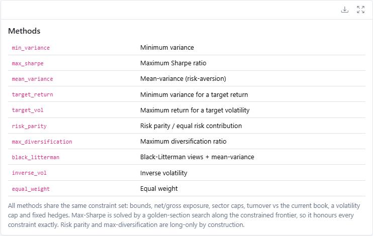

| Method | In plain words | Uses expected returns? |
|---|---|---|
| Minimum variance | The least volatile portfolio that satisfies the constraints | No |
| Maximum Sharpe ratio | The best return per unit of risk | Yes |
| Mean-variance | Maximise return minus a penalty on variance | Yes |
| Target return | Least risk for a given return | Yes |
| Target vol | Most return for a given volatility | Yes |
| Risk parity (ERC) | Every asset contributes the same amount of risk | No |
| Maximum diversification | Maximise the diversification ratio | No |
| Black-Litterman | Start from the market's implied returns, tilt by your views, then mean-variance | Your views |
| Inverse volatility / Equal weight | Simple rules for comparison | No |

### The results

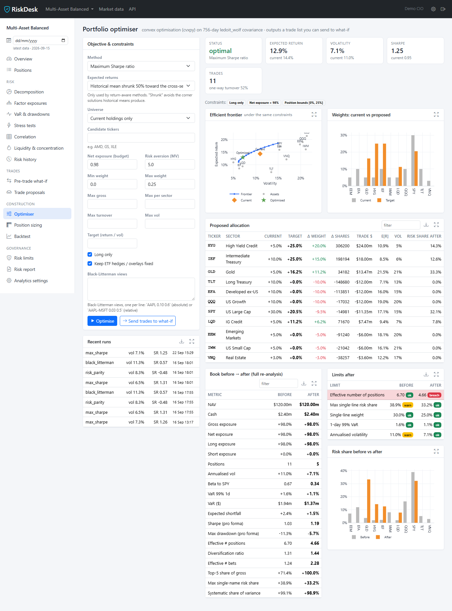

**The cards**

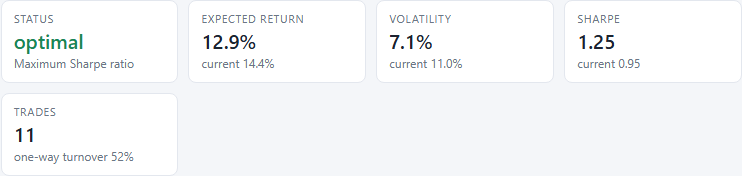

Status *optimal* means the solver found the best answer within the constraints. Expected return 12.9% (current book 14.4%), volatility 7.1% (current 11.0%), Sharpe 1.25 (current 0.95). Eleven trades, with one-way turnover of 52%, meaning about half the book changes hands.

**Efficient frontier**

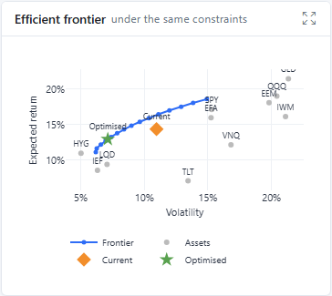

Every point on the blue curve is the best possible return for that level of risk *under the same constraints*. Grey dots are the individual assets. The orange diamond is the current book, sitting below the curve; the green star is the optimised book, on it. The vertical gap between diamond and curve is the return being given up for the risk taken.

**Weights: current vs proposed, and Proposed allocation**

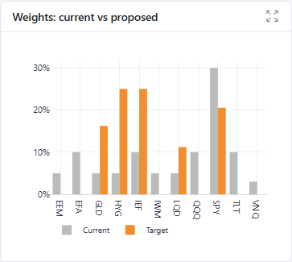

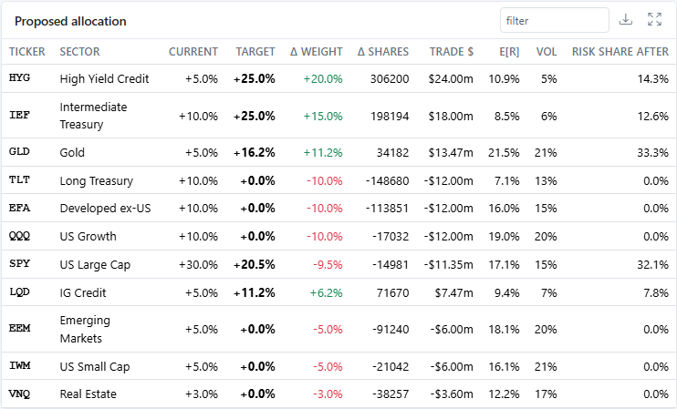

| Column | Meaning |
|---|---|
| Current, Target, Δ weight | Weights before and after |
| Δ shares, Trade $ | The trade at the latest price |
| E[r], Vol | The expected return and volatility the optimiser used for that asset |
| Risk share after | Each asset's share of risk in the new book |

The max-Sharpe answer here is a classic one: 25% each in high-yield credit (HYG) and intermediate Treasuries (IEF), 20.5% in SPY, 16% in gold, 11% in investment-grade credit, and nothing in the rest. That is the optimiser being honest about a two-year window in which bonds and gold had good risk-adjusted returns, and it is also why the next two cards matter.

**Book before → after and Limits after**

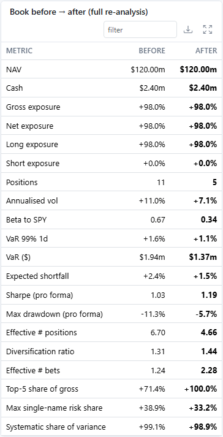 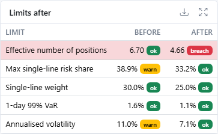

The optimised book is put through the full risk engine, not just the optimiser's own numbers. Here the answer would **breach the "effective number of positions ≥ 5" limit** (5 holdings, effective number 4.7) even though it improves Sharpe. That is the value of running the mandate rules against the optimiser: a mathematically better book can still be an unacceptable one. Tighten *Max weight* to 15% and re-run to get a more spread-out answer.

**Send trades to what-if** carries the trade list to the pre-trade page, where it can be saved as a proposal.

**Black-Litterman views** are typed one per line: `SPY 0.09 0.6` means "I expect SPY to return 9%, confidence 60%"; `GLD-TLT 0.03 0.5` means "gold will beat long Treasuries by 3%, confidence 50%". The result page then shows the market's implied returns, the posterior returns after your views, and the shift.

> **Client question: "Why would I trust an optimiser?"**
> You should not trust it blindly, and this page is built so you do not have to. It shows its assumptions (E[r] and vol per asset), it re-runs every limit on the answer, and it hands you a trade list to inspect rather than executing anything.

## 3.14 Construction › Position sizing

**What it is for.** Three everyday sizing questions: how big should the whole book be, is risk spread sensibly across names, and how much of a new idea can I add?

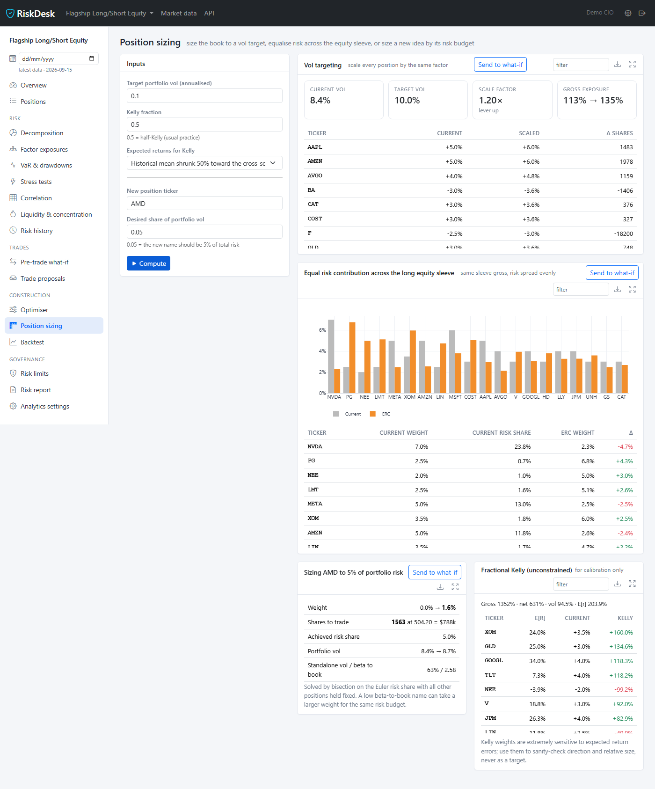

### Inputs

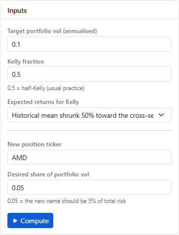

A target volatility for the book, a Kelly fraction, the return model for Kelly, and optionally a new ticker with the share of risk you want it to take.

### Vol targeting

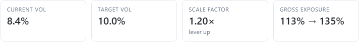

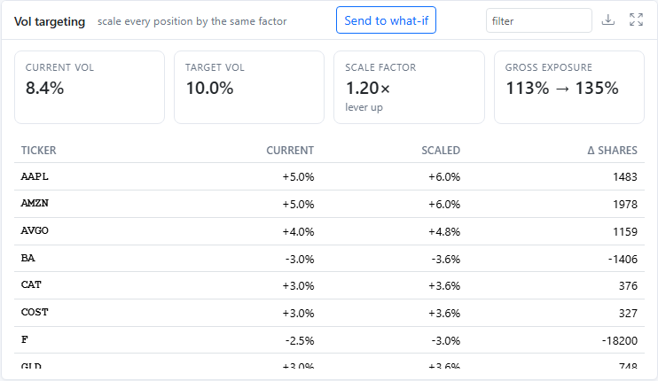

Scale every position by the same factor so the book's volatility hits the target. Current 8.4%, target 10%, so scale by 1.20×: gross exposure goes from 113% to 135%. The table lists the share changes per position. *Send to what-if* tests it.

### Equal risk contribution across the long equity sleeve

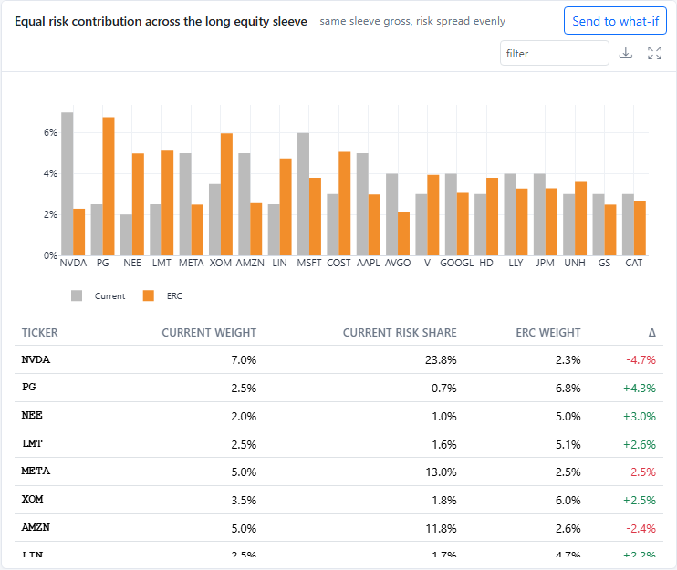

Keep the sleeve's total size, but resize the names so each contributes the same risk. NVDA would fall from 7.0% to 2.3% and PG would rise from 2.5% to 6.8%, because PG is far less volatile and less correlated with the book. This is "risk parity" applied inside the stock sleeve.

### Sizing a new position to a risk budget

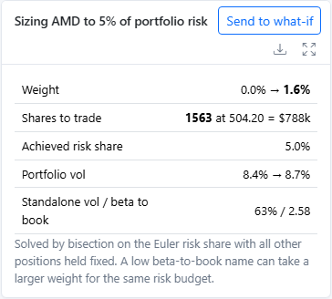

"How much AMD can I hold so that it is 5% of the book's risk?" The answer: 1.6% of NAV, 1,563 shares, $788k. Book volatility would rise from 8.4% to 8.7%. AMD's standalone volatility is 63% and its beta to the book is 2.58, which is why a 5% risk budget buys only 1.6% of weight. A low-beta name would get a much larger weight for the same budget. The number is found by bisection on the Euler risk share with everything else held fixed.

### Fractional Kelly

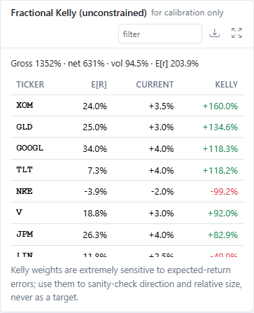

The Kelly criterion is the bet size that maximises long-run growth given expected returns and the covariance. It is famously extreme (here it implies 1352% gross exposure) and hypersensitive to expected-return errors, so it is shown for calibration of *direction and relative size* only, never as a target. The half-Kelly default is the usual practice.

## 3.15 Construction › Backtest

**What it is for.** Testing whether a systematic construction rule would have beaten holding the current weights, on the same universe, after costs.

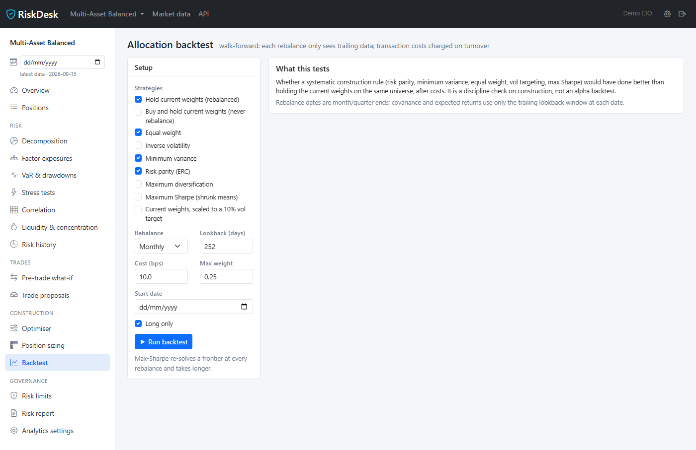

### Setup

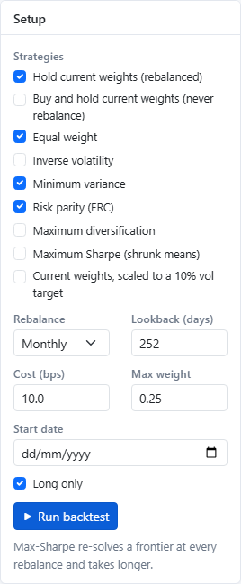

Tick the strategies to compare, choose a rebalance frequency (weekly to annual), the lookback each rebalance may see, transaction cost in basis points (10 bps = 0.10% of traded value), a per-asset weight cap, an optional start date, and long-only.

The backtest is **walk-forward**: at each rebalance date the rule only sees data up to that date, so there is no peeking at the future. Between rebalances weights drift with prices, as they would in a real account. Costs are charged on the turnover of each rebalance.

### Results

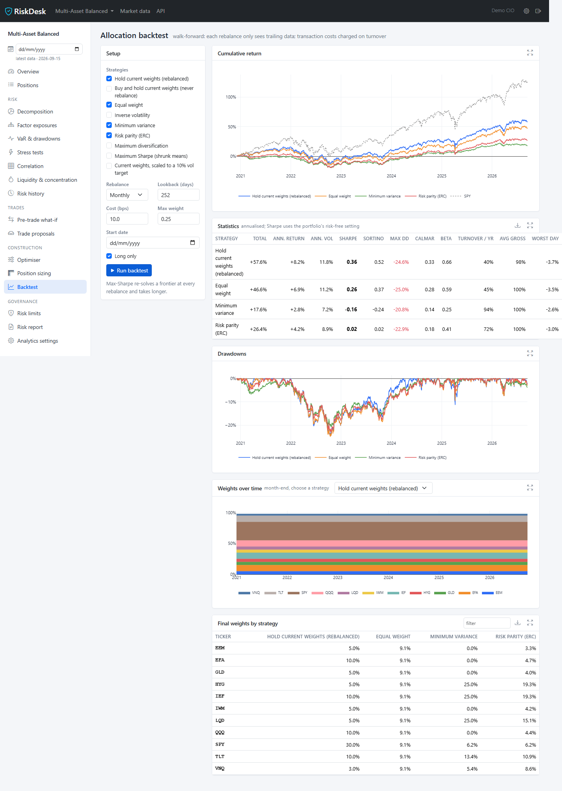

**Cumulative return and Statistics**

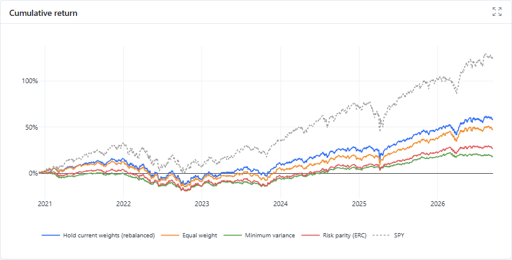

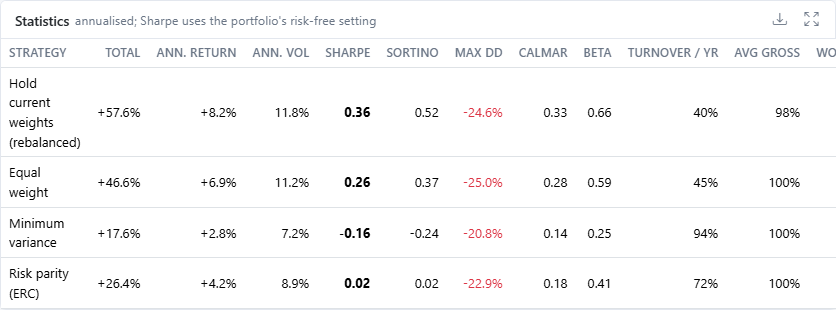

| Column | Meaning |
|---|---|
| Total, Ann. return | Cumulative and yearly return over the test |
| Ann. vol, Sharpe, Sortino, Calmar | Risk-adjusted measures, as on the VaR page |
| Max DD | Deepest drawdown during the test |
| Beta | To the benchmark |
| Turnover / yr | How much of the book is traded per year. Minimum variance trades 94% a year, which is expensive; equal weight only 45% |
| Avg gross | Average gross exposure |
| Worst day | Worst single day |

For the Multi-Asset book over 2021 to 2026, simply holding the current weights and rebalancing monthly (+57.6%, Sharpe 0.36) beat equal weight, risk parity and minimum variance. Risk parity and minimum variance had lower volatility but lower return, because they put more into bonds, which had a poor 2022. This is exactly the kind of honest answer a CIO wants: a fashionable rule does not automatically win.

**Drawdowns, Weights over time, Final weights**

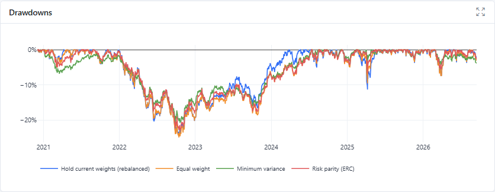

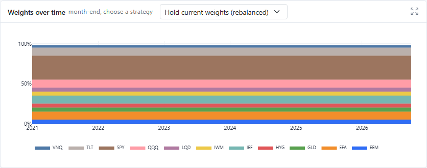

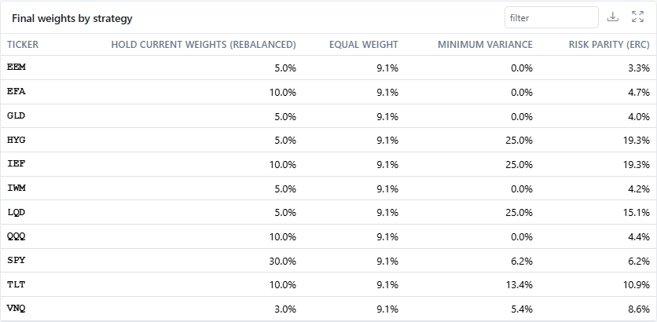

The drawdown chart shows all strategies falling about 20 to 25% in 2022. The weights-over-time chart (pick a strategy from the dropdown) shows how a rule moves money around; for "hold current weights" it is flat by definition, for risk parity it shifts toward bonds as their volatility falls. The final-weights table shows where each rule ended up.

## 3.16 Governance › Risk limits

**What it is for.** Writing the mandate down as rules the software can check, so every page and every what-if reports whether the book is inside it.

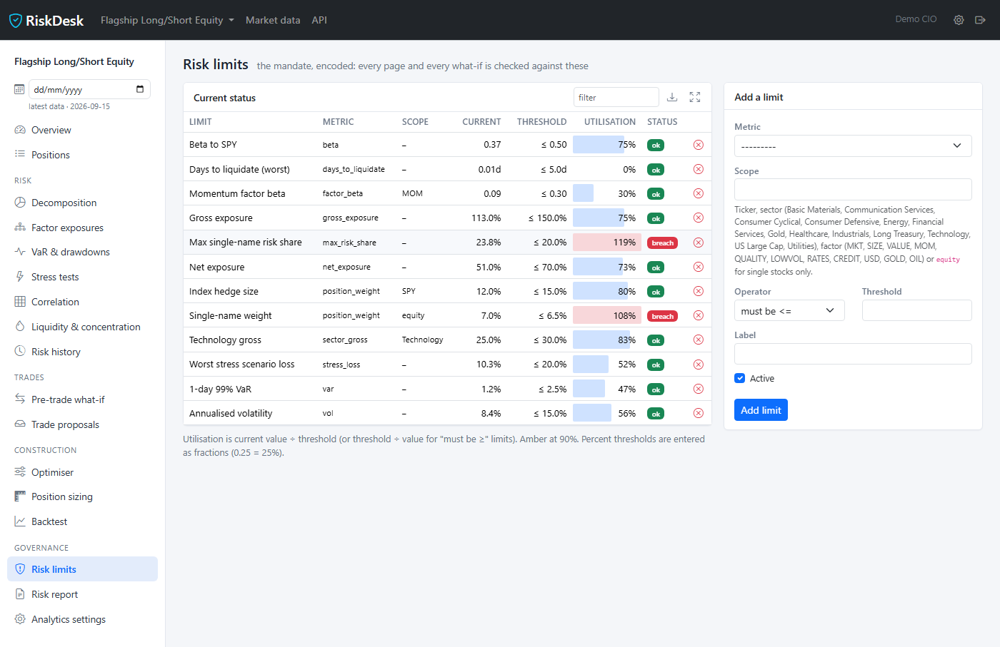

### Current status

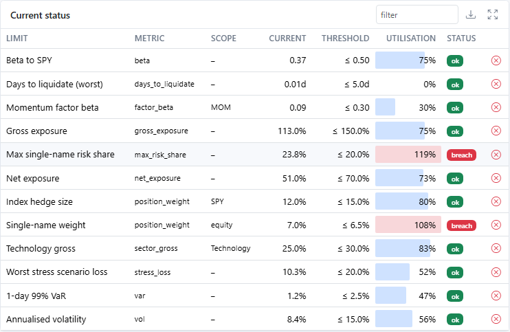

| Column | Meaning |
|---|---|
| Limit | The rule's label |
| Metric, Scope | Which measurement, and where it applies (a ticker, a sector, a factor, or `equity` for "single stocks only") |
| Current, Threshold | The live value and the cap or floor |
| Utilisation | Current ÷ threshold. Amber from 90%, red at 100% |
| Status | ok, warn, breach |

The Flagship book's twelve rules, in the language of a mandate: beta to SPY at most 0.50 (now 0.37); every position exitable within 5 days (0.01d); momentum factor beta at most 0.30 (0.09); gross exposure at most 150% (113%); no single name above 20% of risk (23.8%, **breach**); net exposure at most 70% (51%); the SPY hedge at most 15% (12%); no single stock above 6.5% of NAV (7.0%, **breach**); technology at most 30% (25%); worst stress loss at most 20% (10.3%); one-day 99% VaR at most 2.5% (1.2%); volatility at most 15% (8.4%).

### Add a limit

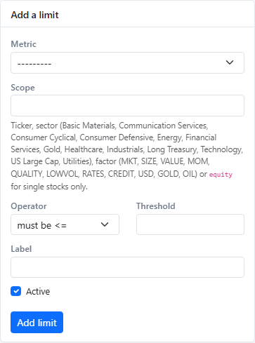

Eighteen measurement types are available: exposures (gross, net, long, short), single position weight, sector gross or net, beta, volatility, VaR, expected shortfall, top-5 share, largest risk share, effective number of positions, days to liquidate, factor beta, worst stress loss, and current drawdown. Thresholds are entered as fractions (0.25 for 25%). The operator is "must be ≤" or "must be ≥".

> **Client question: "Can limits differ by portfolio?"**
> Yes, they belong to the portfolio. The three demo books each have their own set.

## 3.17 Governance › Risk report and exports

**What it is for.** The daily one-page pack: everything a CIO needs to read over coffee, printable to PDF.

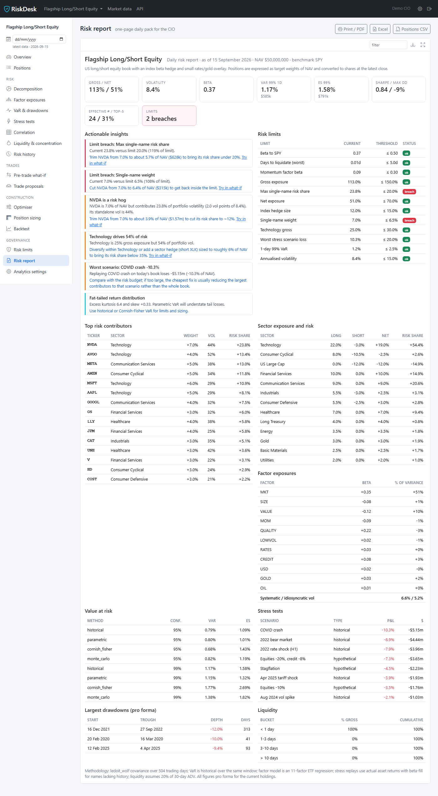

The report gathers the headline cards, the insights, the limit table, top risk contributors, sector exposure and risk, factor exposures, VaR by method, largest drawdowns, stress tests and the liquidity profile, followed by a one-paragraph methodology note. *Print / PDF* uses the browser's print dialog with a print-friendly layout (no sidebar).

Two more exports sit next to it:

- **Excel** downloads a workbook with one sheet each for Summary, Positions, Sectors, Factors, VaR, Stress, Limits, Insights and the full Correlation matrix.
- **Positions CSV** downloads the holdings with price, value, weight, risk share, standalone vol and MCR.

And every table on every page has its own CSV button.

## 3.18 Governance › Analytics settings

**What it is for.** The knobs of the risk model, per portfolio.

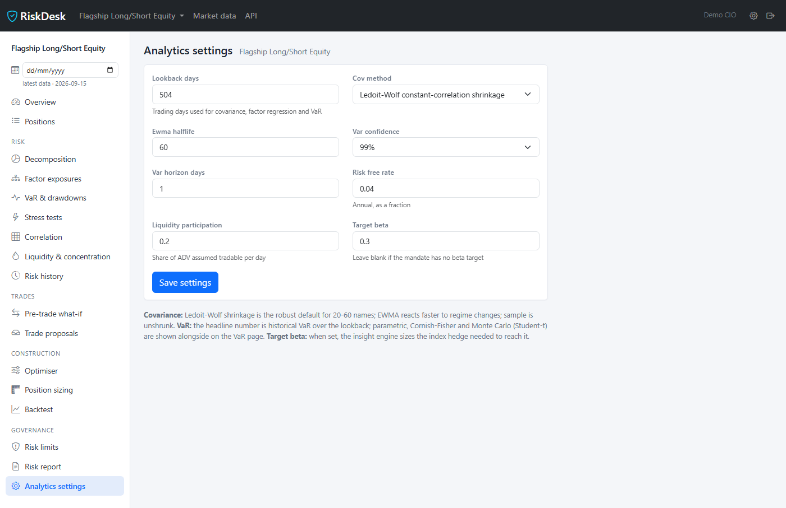

| Setting | Meaning | Default |
|---|---|---|
| Lookback days | How much history the covariance, factor regression and VaR use | 504 (two years) |
| Covariance method | Ledoit-Wolf shrinkage (robust default), EWMA (reacts faster to regime change), or plain sample | Ledoit-Wolf |
| EWMA half-life | For EWMA: after this many days a return counts half as much | 60 |
| VaR confidence, horizon | 95%, 97.5% or 99%; 1 to 20 days | 99%, 1 day |
| Risk-free rate | Used in Sharpe and Sortino | 4% |
| Liquidity participation | Share of daily volume assumed tradable | 20% |
| Target beta | If set, the insight engine sizes the index hedge needed to reach it | blank |

Changing a setting changes every page of that portfolio immediately.

## 3.19 Market data and the instrument page

**Market data** lists every instrument loaded, with the latest price, one-day, one-month and year-to-date returns, one-year volatility, average daily dollar volume, and the date range of its history. Instruments marked *factor* are the ETFs the factor model needs.

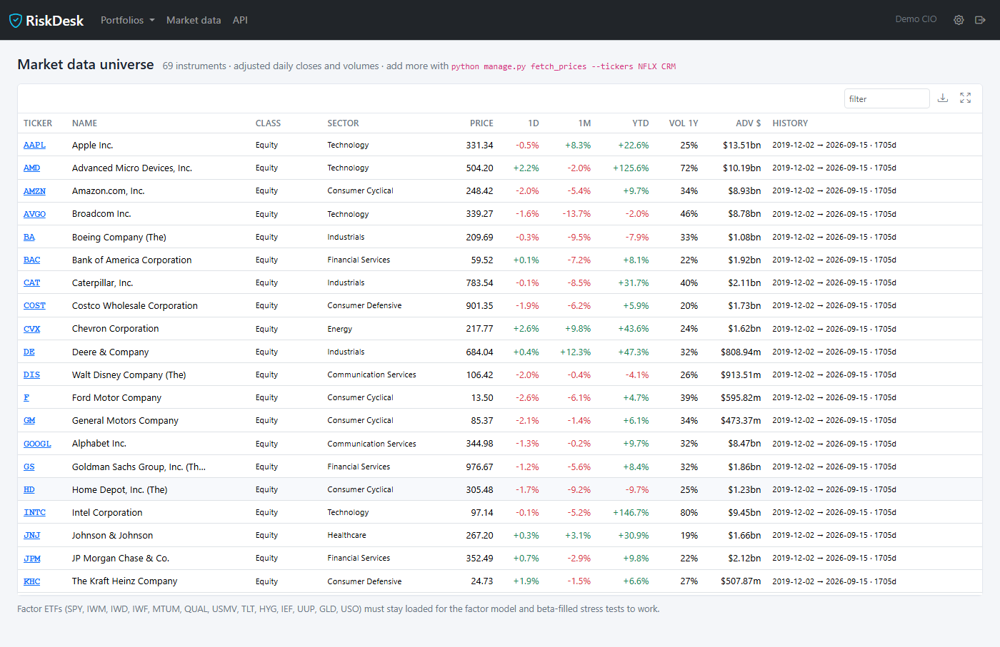

Click any ticker for its **instrument page**:

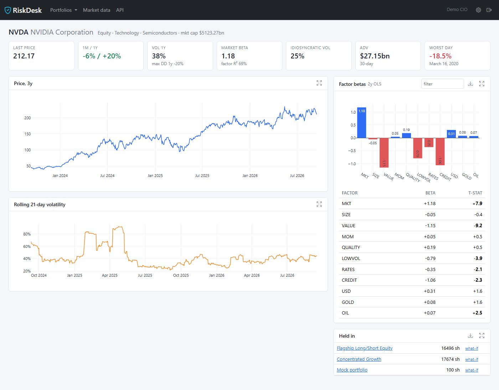

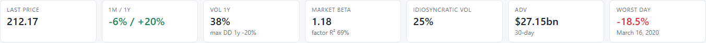

For NVDA: last price $212.17, −6% over a month and +20% over a year, 38% volatility with a −20% max drawdown in the last year, market beta 1.18 with a factor R² of 69%, 25% idiosyncratic volatility, $27bn traded a day, and its worst day (−18.5%) on 16 March 2020.

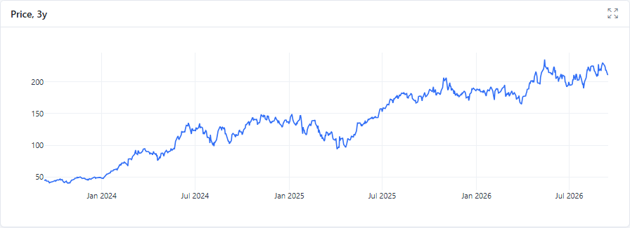 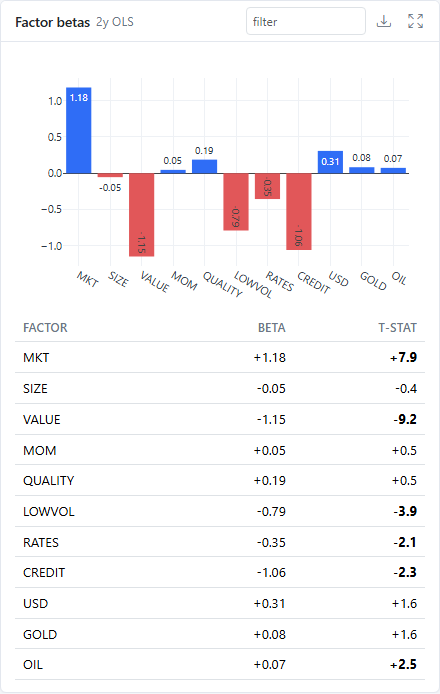

The factor-beta table includes a **t-stat** column: values above 2 (in bold) mean the exposure is statistically solid rather than noise. The *Held in* card lists which portfolios own the name, with a what-if link.

New instruments are added with one command, which also fetches sector and industry:

```bash
python manage.py fetch_prices --tickers NFLX CRM --start 2019-12-01
```

## 3.20 The API

**What it is for.** Everything on screen is available as JSON, so the team can pull numbers into Excel, notebooks or a trading system, and can run a pre-trade check programmatically.

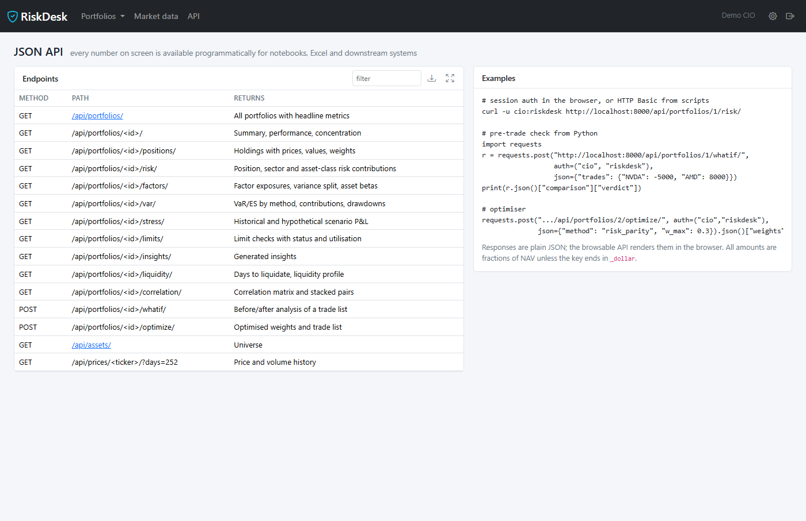

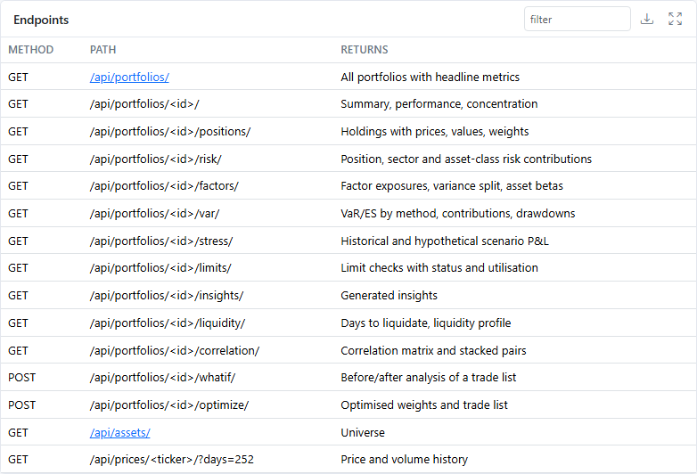 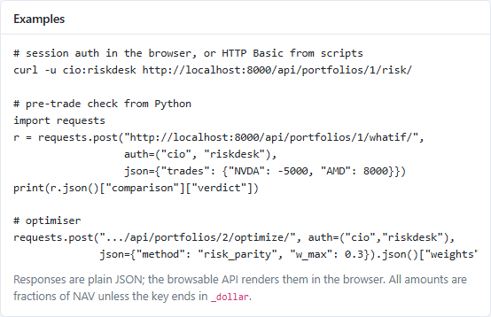

Opening an endpoint in the browser shows a readable version:

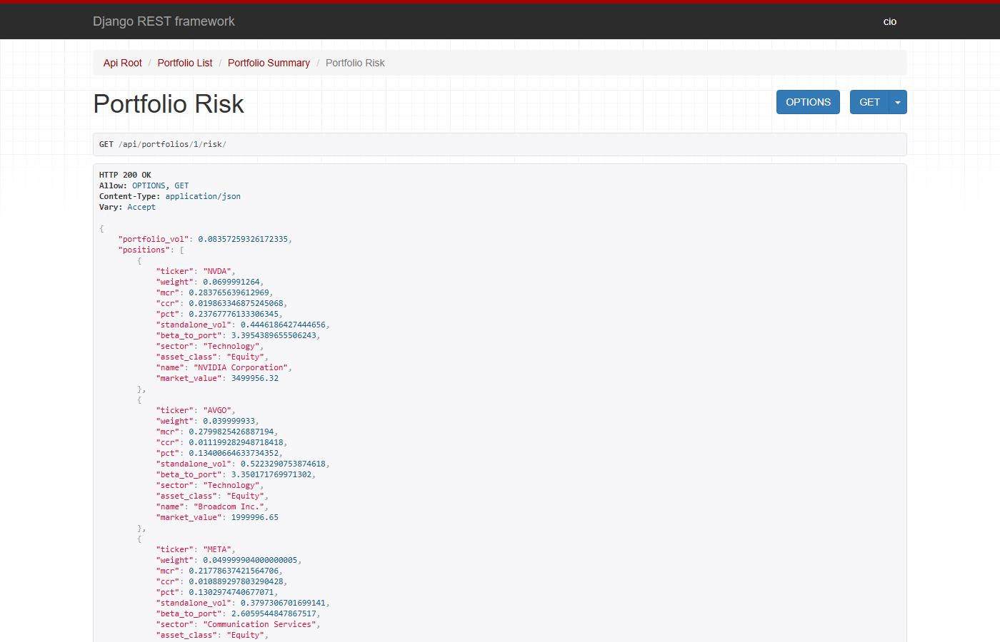

A pre-trade check from Python is three lines:

```python
import requests
r = requests.post("http://127.0.0.1:8000/api/portfolios/1/whatif/", auth=("cio", "riskdesk"),
                  json={"trades": {"NVDA": -5000, "AMD": 8000}})
print(r.json()["comparison"]["verdict"])      # "green", "amber" or "red"
```

## 3.21 The admin site

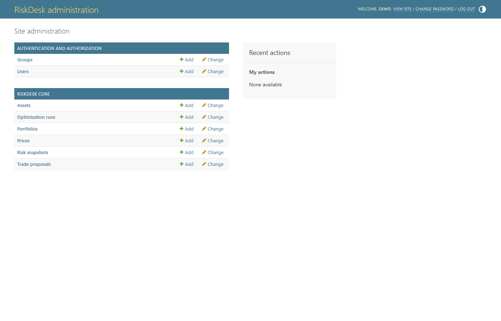

The cog in the top bar opens Django's built-in administration site, where users, permissions, portfolios, positions, limits, proposals and price data can be managed directly.

---

# Part 4 — The maths, in plain words

Each formula is given twice: in words, then in symbols. `w` is the vector of weights (market value ÷ NAV), `Σ` (sigma) the covariance matrix, `r` a daily return.

## 4.1 Returns and the lookback window

A daily return is today's price divided by yesterday's, minus one. Prices are adjusted for dividends and splits. The **portfolio's pro-forma daily return** is the weighted sum of its holdings' returns using *today's* weights:

```
r_portfolio(t) = Σ_i  w_i × r_i(t)
```

The lookback window keeps the last 504 of these days. Everything statistical (volatility, VaR, betas) is computed on that window.

## 4.2 Volatility and the covariance matrix

**Volatility** is the standard deviation of returns, scaled to a year:

```
annual vol = daily standard deviation × √252
```

The **covariance matrix** Σ is a table with one row and column per holding. The diagonal holds each holding's own variance; the off-diagonal cells hold how each pair moves together. Portfolio variance is `w'Σw` and volatility its square root.

With 30 holdings and 504 days the raw sample matrix is noisy. **Ledoit-Wolf shrinkage** blends it with a simple target in which every pair has the same correlation, choosing the blend automatically. "Shrinkage 0.18" on the Flagship header means 18% target, 82% sample. **EWMA** instead weights recent days more heavily, with a half-life of 60 days by default.

## 4.3 Risk contributions (Euler decomposition)

Portfolio risk does not add up the naive way. In a two-stock example, A (60% weight, 40% vol) and B (40%, 20%) with correlation 0.5 give weighted-average volatility of 32% but actual portfolio volatility of 28.8%, because they partly cancel.

Euler decomposition is the one fair split that adds up exactly. Three steps:

1. **Marginal contribution (MCR):** how much portfolio vol rises if you add a tiny bit more of stock i. `MCR_i = (Σw)_i ÷ σ`, where `(Σw)_i` is stock i's covariance with the portfolio.
2. **Component contribution (CCR):** weight × MCR. `CCR_i = w_i × MCR_i`.
3. **Risk share:** `CCR_i ÷ σ`, which simplifies to **weight × beta to the portfolio**.

```
σ = √(w'Σw)          MCR_i = (Σw)_i / σ          CCR_i = w_i × MCR_i          share_i = CCR_i / σ = w_i × β_i
```

For the two-stock example: MCR_A = 0.388, MCR_B = 0.139; CCR_A = 23.3 points, CCR_B = 5.5 points; total 28.8 ✓; shares 81% and 19%.

It adds up because volatility doubles when every position doubles, and a mathematical result (Euler's theorem for homogeneous functions) guarantees that for any such quantity, weight-times-marginal sums to the total. The same trick works for Expected Shortfall (the ES contributions chart) and tracking error.

Two cautions: it is exact only for small changes, so large trades should be re-run in full (the what-if page does this); and it inherits any error in the covariance matrix.

## 4.4 Value at Risk and Expected Shortfall

**VaR at confidence c over one day** is the loss that is exceeded only (1 − c) of the time. **ES** is the average loss given that the VaR line is crossed. Four estimators:

```
historical:      VaR = −(the (1−c) quantile of the 504 daily returns);   ES = −(mean of returns below that quantile)
parametric:      VaR = −(μ + z_c × σ_daily),   z_0.99 = −2.326;          ES = −(μ − σ × φ(z_c)/(1−c))
cornish-fisher:  replace z_c by  z + (z²−1)S/6 + (z³−3z)K/24 − (2z³−5z)S²/36   (S = skew, K = excess kurtosis)
monte carlo:     simulate 20,000 days  r = L × t_5 × √((5−2)/5)  with L the Cholesky factor of Σ; read the quantile
```

For a multi-day horizon the app multiplies by √(horizon days). Component ES is the average P&L of each position on the tail days.

Why the methods disagree on the Flagship book: kurtosis 6.4 means far more extreme days than a bell curve allows, so parametric (1.15%) understates, Cornish-Fisher (1.77%) corrects for it, and historical (1.17%) sits in between because the two-year window contained one severe episode (April 2025). Monte Carlo with a Student-t(5) distribution (1.38%) is the fat-tailed model estimate.

## 4.5 The factor model

Each holding's daily return is regressed (ordinary least squares) on the eleven factor returns with an intercept:

```
r_i = α_i + Σ_k β_ik × F_k + ε_i
```

`β_ik` is stock i's exposure to factor k, `ε_i` the stock-specific residual. Portfolio exposure to factor k is `Σ_i w_i β_ik`. Portfolio variance splits into a **systematic** part `b'F b` (b = portfolio betas, F = factor covariance) and an **idiosyncratic** part `Σ_i w_i² × var(ε_i)`, assuming residuals are independent. Each factor's contribution is `b_k × (F b)_k`, which can be negative when a factor exposure offsets the others (the QUALITY row).

The hypothetical stress tests and the beta-fill for names lacking history both reuse these betas: implied return of stock i under shocks s is `Σ_k β_ik × s_k`.

## 4.6 Stress tests

**Historical replay:** for each holding, price at the end of the window ÷ price at the start, minus one, multiplied by today's weight, summed. Names without prices in the window get the beta-implied return.

**Hypothetical shock:** the factor-implied return above, summed across holdings.

**Single-name 3σ shock:** stock i falls 3 × its daily standard deviation. Every other stock j is assumed to move by its conditional expectation `ρ_ij × σ_j / σ_i × (move in i)`, the standard result for correlated normal variables. Own loss plus spillover is the total.

**Worst 10-day windows:** the rolling ten-day compounded pro-forma return, sorted, with overlapping windows removed.

## 4.7 Concentration and liquidity measures

```
HHI               = Σ_i (gross weight_i / total gross)²                  1 = one position, small = spread out
Effective N       = 1 / HHI
Top-N share       = gross weight of the largest N ÷ total gross
Diversification ratio = (Σ_i |w_i| × σ_i) / σ_portfolio                  1 = no benefit, higher = more diversification
Effective # bets  = exp(entropy of the variance shares along the principal components of Σ)   (Meucci 2009)
Days to liquidate = |shares| / (30-day average daily volume × participation)
Impact cost       ≈ ½ × σ_daily × √(participation) × |position value|     (square-root market-impact law)
```

The **effective number of bets** deserves a sentence: it rotates the book into its independent sources of variance (principal components) and asks how evenly the variance is spread across them. Thirty correlated stocks that all load on one component count as roughly one bet; the Flagship book counts as 7.2.

## 4.8 The optimisers

All are solved with cvxpy, a convex optimisation library, and share one constraint set: bounds per asset, net exposure, gross exposure, group (sector) caps, turnover against the current book, a volatility cap, tracking-error cap and fixed weights for hedges.

```
min variance:        minimise  w'Σw
mean-variance:       maximise  μ'w − ½λ w'Σw                    λ = risk aversion
target return:       minimise  w'Σw   subject to  μ'w ≥ target
target vol:          maximise  μ'w    subject to  w'Σw ≤ target²
max Sharpe:          golden-section search over target returns along the constrained frontier, picking the highest (μ'w − rf)/σ
risk parity:         minimise  ½ w'Σw − Σ_i b_i log w_i,  then rescale to sum to 1   (b = risk budgets, equal by default)
max diversification: minimise  y'Σy  subject to  σ'y = 1, y ≥ 0,  then w = y / Σy
```

Max Sharpe is solved by search rather than the textbook transformation because sector caps and turnover limits break the textbook method's assumptions; the search honours every constraint exactly.

**Black-Litterman.** Start from the returns the market implies given market-cap weights, `π = δ Σ w_mkt`. Express views as a matrix P and vector Q (absolute view: one +1; relative view: +1 and −1), with a confidence that sets the view's uncertainty Ω. The posterior expected return is

```
μ_BL = π + τΣP' (PτΣP' + Ω)⁻¹ (Q − Pπ)
```

which is then fed to mean-variance. With no views the posterior equals the prior, so the optimiser returns the market portfolio.

**Expected returns** for return-aware methods default to "shrunk": 50% the asset's historical mean, 50% the cross-sectional average. Historical, exponentially weighted and CAPM-implied are the alternatives.

## 4.9 The backtest

At each rebalance date the rule is given only the trailing lookback of returns, sets target weights, and pays `cost × Σ|w_new − w_old|`. Each following day the portfolio return is `Σ w_i r_i` and the weights drift: `w_i ← w_i (1 + r_i) / (1 + r_portfolio)`. Statistics are computed on the resulting daily return series exactly as on the VaR page. Turnover per year is total one-way turnover divided by the number of years.

## 4.10 The insight rules

The insight engine is a list of ten fixed rules, run in order, then sorted high → medium → low → info. Every threshold is a plain number in `analytics/insights.py`.

| # | Rule | Fires when | Suggested action |
|---|---|---|---|
| 1 | Limit breach / near-breach | Any limit is red or amber | For weight and risk-share limits, the exact trim that clears the limit, pre-filled for what-if |
| 2 | Risk hog | Risk share ≥ 15% and ≥ 1.8 × money share | The weight that halves the risk share, found by bisection |
| 3 | Sector concentration | One sector > 45% of risk | Short the sector ETF for 30% of the sector's weight |
| 4 | Factor tilt | \|beta\| > 0.25 and > 8% of variance | Neutralise with the factor's ETF pair if unintended |
| 5 | Hedge sizing | Target beta set and \|beta − target\| > 0.15 | The benchmark trade that reaches the target |
| 6 | Correlated pairs | Correlation > 0.75, same direction | Size the pair as one position |
| 7 | Concentration | Top-5 > 50% of gross, or < 3 effective bets | Spread the tail or accept explicitly |
| 8 | Liquidity | Any position > 5 days to exit | Cap it at a 3-day size |
| 9 | Stress | Worst scenario < −10% | Trim the largest contributors to that scenario |
| 10 | Tail shape | Kurtosis > 5, or drawdown < −8% | Use historical VaR; consider vol-scaling down |

---

# Part 5 — Questions a client may ask

**"Where does the data come from?"** Daily adjusted prices and volumes from Yahoo Finance via the `yfinance` library, bundled as CSV so the demo runs offline. Any vendor feed can be loaded into the same price table. Sector and industry come from the same source.

**"Can it use our real book?"** Yes: CSV upload, the API, or a scheduled database load. Add any missing instruments with one command. See [3.3](#33-positions) and [Part 8](#part-8--for-developers).

**"How often does it update?"** Every page recomputes from the price table on load, in well under a second. Run `fetch_prices` and `snapshot_risk` once a day (a scheduled task) and the whole system is current.

**"Is any of this a black box?"** No. Every method is standard (Ledoit-Wolf, Euler, historical/parametric/Cornish-Fisher/Monte Carlo VaR, OLS factor model, cvxpy optimisation), every formula is in [Part 4](#part-4--the-maths-in-plain-words), the insight rules are ten lines of thresholds, and the source is readable Python with 32 automated tests.

**"Why is the risk share different from the weight?"** Because a stock's contribution to risk depends on its volatility and its correlation with everything else, not just its size. [3.4](#34-risk--decomposition) and [4.3](#43-risk-contributions-euler-decomposition).

**"Which VaR do you recommend?"** Historical 99% one-day as the headline, Expected Shortfall alongside, parametric shown only for comparison. [3.6](#36-risk--var--drawdowns).

**"What does the what-if verdict mean?"** Green: no new breach and risk up less than 10%. Amber: no new breach but vol or VaR up more than 10%. Red: at least one new limit breach. [3.11](#311-trades--pre-trade-what-if).

**"Can I trust the optimiser?"** Treat it as a proposal generator. It shows its assumptions and re-runs every limit on its answer. [3.13](#313-construction--optimiser).

**"Does the performance chart show our real returns?"** No, it is pro forma: today's holdings replayed over the past. It describes the risk of the book you hold, not the fund's track record. [2.1](#21-conventions-every-number-follows).

**"How do I see what the book looked like last month?"** The as-of date in the sidebar. [2.3](#23-the-sidebar-and-the-as-of-date).

**"Can we get the numbers into Excel?"** Yes: the Excel risk pack, the positions CSV, the CSV button on every table, or the API. [3.17](#317-governance--risk-report-and-exports).

**"What would it take to put this into production?"** Point it at a production database (Postgres), set the secret key and allowed hosts, serve it behind a web server, and schedule the two daily commands. [Part 8](#part-8--for-developers).

---

# Part 6 — A ten-minute demo script

1. **Home** (30 s). Four books, one glance. Point at the red badge on Concentrated Growth and the green one on the mock book.
2. **Flagship Overview** (2 min). Read the eight cards aloud. Show that NVDA is 7% of the money and 24% of the risk. Show the two red limits. Read the first insight and its dollar figure.
3. **Decomposition** (1 min). The bubble chart: everything above the diagonal is a risk hog. Hover NVDA.
4. **Factor exposures** (1 min). Market beta 0.35, growth tilt (VALUE −0.12), 62% systematic. Hover the heat map on the semiconductor rows.
5. **Stress tests** (1 min). COVID −10% vs SPY −34%. Type MKT −0.10 into the custom shock and run it.
6. **What-if** (2 min). From the NVDA insight, click *Try in what-if*. Add AMD at 3% via the holdings chips. Analyse: green verdict, two breaches fixed, VaR down. Save as proposal, approve, book it.
7. **Optimiser** (1 min, Multi-Asset). Max Sharpe: Sharpe 0.95 → 1.25, but the effective-number limit breaches. Set max weight 0.15 and re-run.
8. **Backtest** (1 min, Multi-Asset). Holding current weights beat risk parity after costs. A fashionable rule does not automatically win.
9. **Risk report** (30 s). Print preview. Then the Excel button.
10. **As-of date** (30 s). Set 8 April 2025 on the Overview. "This is what your book would have looked like the morning after the tariff announcement."

---

# Part 7 — Glossary

**ADV.** Average daily volume, the number of shares (or dollars) traded per day, averaged over 30 days.

**Alpha.** The part of return not explained by the benchmark. Positive alpha means the book did better than its beta alone would predict.

**Annualised.** A daily or monthly figure scaled to a yearly one so books can be compared. Volatility scales with the square root of time; returns compound.

**Basis point (bp).** One hundredth of a percent. 10 bps = 0.10%.

**Beta.** Sensitivity: how much one thing moves when another moves 1%. Beta to SPY, beta to a factor, beta to the book.

**Black-Litterman.** A way to mix the market's implied expected returns with your own views before optimising.

**Calmar ratio.** Annual return divided by the size of the maximum drawdown.

**Component contribution (CCR).** A position's share of portfolio volatility, in volatility points. All CCRs sum to the total.

**Correlation.** From −1 to +1, how closely two things move together.

**Covariance matrix.** The table of how every pair of holdings moves together. The engine behind volatility, risk contributions, VaR and optimisation.

**Cornish-Fisher.** A bell-curve VaR adjusted for skew and kurtosis.

**Drawdown.** How far the book is below its previous high. Maximum drawdown is the worst such fall.

**Effective number of bets.** How many independent bets a correlated book behaves like.

**Effective number of positions.** 1 ÷ HHI: how many equal-sized positions would give the same concentration.

**ES (Expected Shortfall, CVaR).** The average loss on the days that exceed VaR.

**Euler decomposition.** The method that splits total volatility into per-position pieces that add up exactly. See [4.3](#43-risk-contributions-euler-decomposition).

**EWMA.** Exponentially weighted moving average: recent days count more.

**Factor.** A broad market force (market, value, momentum, rates...) that moves many stocks at once.

**Gross exposure.** Longs plus shorts, as a share of NAV.

**HHI.** Herfindahl-Hirschman index, a concentration score: the sum of squared weights.

**Idiosyncratic.** Stock-specific, not explained by factors.

**Information ratio.** Excess return over the benchmark divided by tracking error.

**Kelly criterion.** The bet size that maximises long-run growth; extreme in practice, used at a fraction.

**Kurtosis.** Fatness of the tails of the return distribution. A bell curve has excess kurtosis 0; the Flagship book has 6.4.

**Ledoit-Wolf shrinkage.** A method that stabilises a noisy covariance matrix by blending it with a simple target.

**Long / short.** Owning a stock (profit if it rises) / having sold a borrowed stock (profit if it falls).

**Lookback.** The window of history the model uses.

**Marginal contribution (MCR).** How much portfolio volatility rises per unit of extra weight in a position.

**Max Sharpe.** The portfolio with the best return per unit of risk.

**Monte Carlo.** Estimating risk by simulating thousands of random days from the model.

**NAV.** Net asset value, positions plus cash.

**Net exposure.** Longs minus shorts, as a share of NAV.

**Parametric VaR.** VaR assuming returns follow a bell curve.

**Principal component.** A statistical "super-factor" built from the covariance matrix; the first one captures the most common movement.

**Pro forma.** "As if": today's holdings replayed over the past. Describes the current book's behaviour, not the fund's history.

**Risk parity / ERC.** Equal risk contribution: every position contributes the same volatility.

**Risk share.** A position's fraction of total portfolio volatility.

**Sharpe ratio.** (Return − cash rate) ÷ volatility.

**Skew.** Whether big moves lean up (positive) or down (negative).

**Sortino ratio.** Like Sharpe, but only downside volatility is penalised.

**Systematic.** Explained by factors.

**Tracking error.** Volatility of the difference between book and benchmark returns.

**Turnover.** The share of the book traded over a period.

**Utilisation.** How close a metric is to its limit: value ÷ threshold.

**VaR (Value at Risk).** The loss that is exceeded only rarely (1 day in 100 at 99% confidence).

**Volatility.** The standard deviation of returns: the typical size of a swing.

**Walk-forward.** A backtest in which each decision sees only the data available at the time.

---

# Part 8 — For developers

## Using your own book

1. **Instruments and prices.** `python manage.py fetch_prices --tickers NFLX CRM --start 2019-12-01` pulls adjusted closes, volumes and reference data from Yahoo Finance. Run `fetch_prices` with no arguments to update everything. Other sources can be written straight into the `Price` table. The factor ETFs (SPY, IWM, IWF, IWD, MTUM, QUAL, USMV, TLT, IEF, HYG, UUP, GLD, USO) must stay loaded.
2. **Positions.** Create a portfolio, then upload a CSV (`ticker, quantity[, avg_cost, note]`), edit inline, or use the admin. Portfolios can also be described as target weights in `data/sample/portfolios.json` and loaded with `load_sample_data`.
3. **Limits and settings.** Per portfolio, on the Risk limits and Analytics settings pages.
4. **Daily jobs.** `python manage.py fetch_prices` then `python manage.py snapshot_risk`. `snapshot_risk --backfill 60` rebuilds two months of history.

## Commands

| Command | Purpose |
|---|---|
| `load_sample_data [--reset] [--skip-prices]` | Load the bundled universe and demo portfolios (idempotent) |
| `fetch_prices [--tickers ...] [--start ...]` | Add or update instruments from Yahoo Finance |
| `snapshot_risk [--backfill N]` | Record daily headline risk for the history page |
| `test` | Run the 32 unit and integration tests |
| `scripts/build_sample_data.py` | Rebuild the bundled CSVs from scratch |
| `scripts/capture_guide_screenshots.py` | Regenerate every screenshot in this guide from a running server |
| `scripts/dump_guide_numbers.py` | Dump the numbers behind every page to `docs/guide/numbers.json` |

## Project layout

```text
analytics/      framework-free quant library: returns, covariance, risk, factors, stress, liquidity,
                concentration, optimize, backtest, insights, engine (the PortfolioAnalyzer facade)
core/           Django models (Asset, Price, Portfolio, Position, RiskLimit, TradeProposal, TradeLine,
                OptimizationRun, RiskSnapshot), admin, management commands
web/            views, forms, templates, before/after comparison, template filters, in-process analyzer cache
api/            Django REST Framework endpoints
data/sample/    bundled prices, reference data and demo portfolios
docs/guide/     the screenshots and numbers used in this document
tests/          unit tests for analytics, integration tests for views and API
```

## Stack

Django 5, Django REST Framework, pandas, NumPy, SciPy, cvxpy (Clarabel/OSQP/SCS solvers), openpyxl, yfinance. Front end: Bootstrap 5 and Plotly.js from CDN, plus one small JavaScript file for the card tools. Database: SQLite by default.

## Production notes

Set `RISKDESK_SECRET_KEY`, `RISKDESK_DEBUG=0`, `RISKDESK_ALLOWED_HOSTS`, and point `RISKDESK_DB` at a persistent path or swap the `DATABASES` block for Postgres. Serve with gunicorn or uvicorn behind nginx and run `collectstatic`. Schedule `fetch_prices` and `snapshot_risk` daily. Users and permissions are managed in the admin site.
